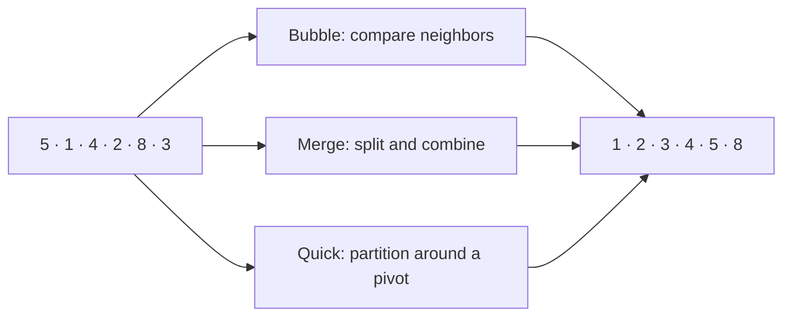
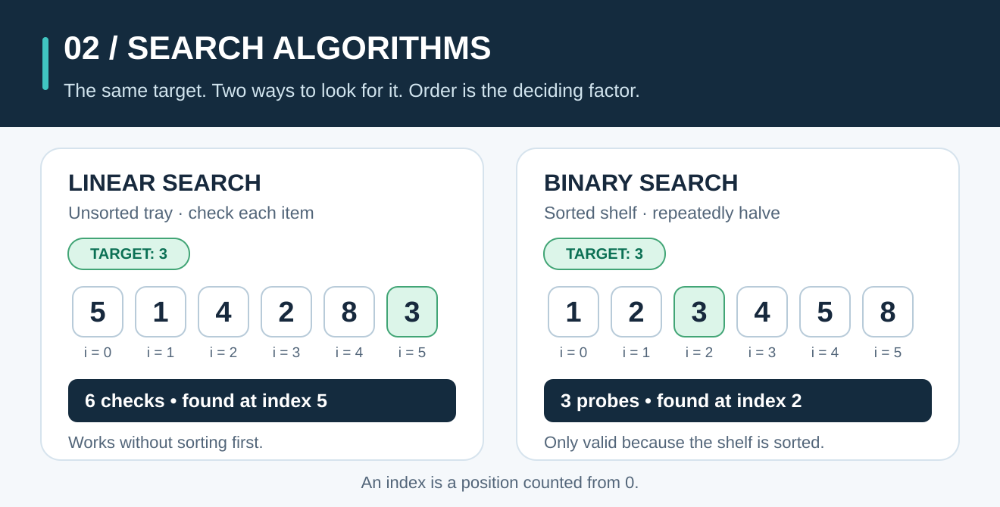
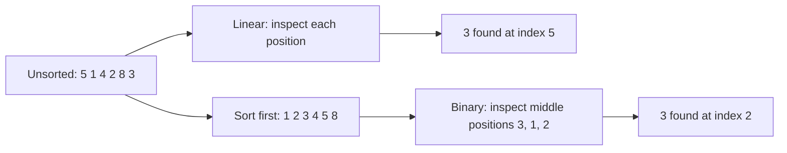
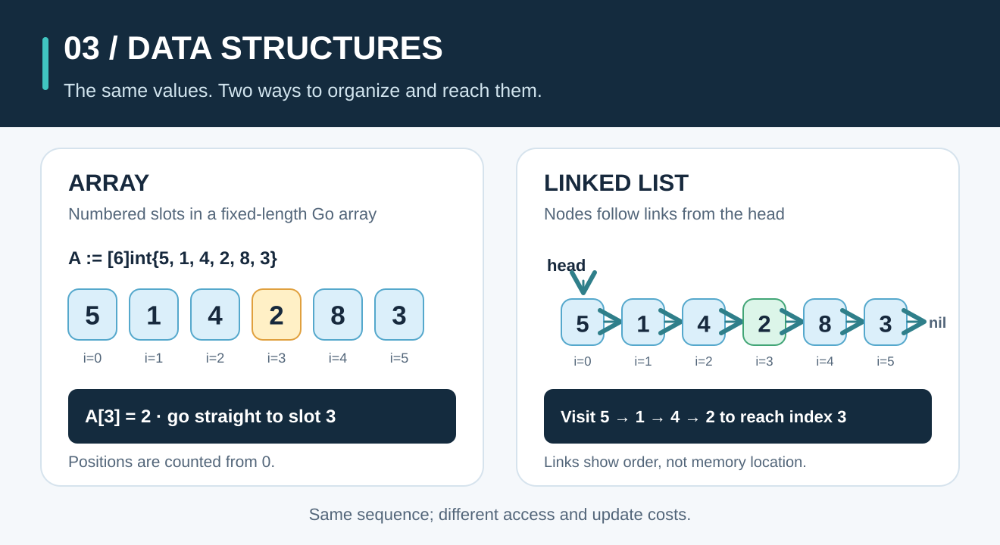
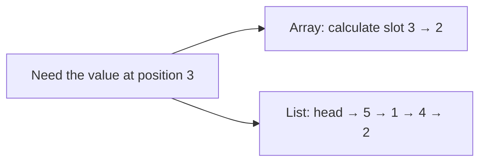

# Algorithms, Made Clear

**Algorithms and data structures explained through everyday stories, pictures, classroom math, and runnable Go.**

The three chapters use the same six numbers. First, put them in order with Bubble Sort, Merge Sort, or Quick Sort. Then find a number with Linear Search or Binary Search. Finally, see how Arrays and Linked Lists store and reach those numbers. Each guide moves from a familiar situation to a visual trace, a step-by-step method, the math behind it, and a runnable Go example.

- [Chapter 1: Sorting Algorithms](#chapter-1-sorting-algorithms)
- [Chapter 2: Search Algorithms](#chapter-2-search-algorithms)
- [Chapter 3: Data Structures](#chapter-3-data-structures)

## Chapter 1: Sorting Algorithms

Books of different heights, a pile of receipts, and numbered pickup tickets can all be put in order. There is more than one way to do it: compare neighbors, sort smaller groups and combine them, or split items around a chosen reference number. Those are the ideas behind Bubble Sort, Merge Sort, and Quick Sort.


This chapter covers **three sorting algorithms**. Start with the story and picture, then work through the classroom-style calculations and run the Go code. You can understand the idea before reading the equations.

### Sorting in one minute

Sorting puts items in a chosen order. Here, the rule is **smaller number first**:

```text
Before: 5  1  4  2  8  3
After:  1  2  3  4  5  8
```

For real items, decide what the number means: a book's height, a receipt's total, or a pickup ticket's number. The sorting algorithm follows that rule; it does not decide the rule for you.

| Algorithm | Picture to keep in mind | Read the visual guide |
| --- | --- | --- |
| **Bubble Sort** | Compare neighboring books by height; swap those in the wrong order. | [Bubble Sort](guides/bubble-sort.md) |
| **Merge Sort** | Split a pile of receipt totals, then combine sorted piles in order. | [Merge Sort](guides/merge-sort.md) |
| **Quick Sort** | Put pickup tickets on either side of one reference ticket; repeat within each side. | [Quick Sort](guides/quick-sort.md) |



### Work through it like a classroom problem

All three guides use the same input. Number the positions from **0**, as Go does:

| Position `i` | 0 | 1 | 2 | 3 | 4 | 5 |
| --- | --- | --- | --- | --- | --- | --- |
| Value `A[i]` | 5 | 1 | 4 | 2 | 8 | 3 |

Read each guide in four ways: **picture** (what moves), **trace** (the row after each step), **pseudocode and Go** (how to repeat it), and **math** (why it works and how much work it does). Pause before each row and predict the next result. For example, Bubble Sort first compares `A[0] = 5` with `A[1] = 1`; because `5 > 1`, it swaps them and the row becomes `[1, 5, 4, 2, 8, 3]`.

In the calculations, `n` is the number of values, `A[i]` is the value at position `i`, and `T(n)` means the work needed to sort `n` values. The final answer is always `[1, 2, 3, 4, 5, 8]`; the steps and costs differ.

### Which sorting method should I choose?

| Algorithm | Best | Typical | Worst | Extra memory | Keeps equal items in their original order? |
| --- | --- | --- | --- | --- | --- |
| Bubble Sort | O(n) | O(n²) | O(n²) | O(1) | Yes |
| Merge Sort | O(n log n) | O(n log n) | O(n log n) | O(n) | Yes |
| Quick Sort here | O(n log n) | O(n log n) | O(n²) | O(log n) typical; O(n) worst, for recursion | No |

- **Learning the idea?** Start with Bubble Sort: every comparison is easy to see. It becomes slow as the list grows.
- **Need reliable performance and the original order of ties?** Merge Sort is a good model. It needs another array while sorting.
- **Want to see how partitioning can sort without a full second array?** Study Quick Sort. Its pivot choice matters: this teaching version chooses the last value, so already sorted or all-equal input can take O(n²) time.

“Stable” means ties keep their earlier order. If two receipts both total $20 and receipt A came before receipt B, a stable sort leaves A before B. “Extra memory” counts space beyond the original list; the Quick Sort row includes its recursive calls.

**For a real Go application, use the standard library** rather than these teaching implementations: [`slices.Sort`](https://pkg.go.dev/slices#Sort) for ordered values, [`slices.SortFunc`](https://pkg.go.dev/slices#SortFunc) for a custom comparison, or [`slices.SortStableFunc`](https://pkg.go.dev/slices#SortStableFunc) when ties must retain their original order. The `slices` package is part of Go's standard library starting with [Go 1.21](https://go.dev/doc/go1.21).

### Run the sorting example

Install Go 1.22 or newer, then run this from the repo root on **macOS, Linux, or Windows (PowerShell)**:

```sh
go run ./examples/sorting
```

```text
Before: [5 1 4 2 8 3]
Bubble: [1 2 3 4 5 8]
Merge : [1 2 3 4 5 8]
Quick : [1 2 3 4 5 8]
```

Each function changes the slice you pass to it. The example copies the starting values so that all three methods get the same input. Read the [Go implementations](sorting/sort.go) or run the checks with `go test ./...`.

### A few words you will meet

- **Pass:** one trip through the values being examined.
- **Pivot:** the reference value used to split a Quick Sort section.
- **Comparison:** checking which of two values should come first. **Swap:** exchanging their positions.
- **`log₂ n`:** roughly how many times `n` can be halved before reaching 1. For example, `8 → 4 → 2 → 1` takes three halvings, so `log₂ 8 = 3`.
- **`O(f(n))`:** an upper bound on how work grows as `n` grows, ignoring constant factors. `Θ(f(n))` means a matching upper and lower growth bound. The guides derive `O(n)`, `O(n²)`, and `O(n log n)`; these are growth descriptions, not exact seconds.
- **Stable:** items with equal sort values keep their earlier relative order.

The diagrams show the same numbers as the runnable code, so you can compare each step with the final output.

## Chapter 2: Search Algorithms

Searching answers a different question: **where is the value I want?** Imagine checking numbered items in a messy lost-and-found tray, then looking up a shelf number on a neatly ordered library shelf. Those situations call for different methods.



We look for `3` in the same values from Chapter 1. Positions start at `0`, and **`-1` means “not found.”** Both teaching functions return the **first** matching position and leave their input unchanged.

| Method | Input | How it works | This example |
| --- | --- | --- | --- |
| [**Linear Search**](guides/linear-search.md) | Any order | Check positions from left to right. | `[5, 1, 4, 2, 8, 3]`: check `0, 1, 2, 3, 4, 5`; find `3` at index **5**. |
| [**Binary Search**](guides/binary-search.md) | **Sorted ascending** | Check the middle, then discard the half that cannot contain the first match. | `[1, 2, 3, 4, 5, 8]`: check middle positions `3, 1, 2`; find `3` at index **2**. |

The indices differ because sorting changes positions. Binary Search **cannot be used correctly on the unsorted row**. Our version keeps narrowing even after seeing a match so it can return the first copy when values repeat.



### Which search method should I choose?

- **One lookup in unsorted data?** Linear Search works immediately: best case `Θ(1)`, worst case `Θ(n)` comparisons, and `O(1)` extra space.
- **Repeated lookups in data already sorted ascending?** Binary Search narrows the possible positions by about half each step: `Θ(log n)` work and `O(1)` extra space for this first-match implementation.
- **Unsorted data with just one lookup?** Sorting it first costs work and changes positions; a linear scan is often the simpler choice. If the data is updated, keeping it sorted has a cost too.

The [Linear Search guide](guides/linear-search.md) counts every check and derives its average under a stated assumption. The [Binary Search guide](guides/binary-search.md) shows the interval after every midpoint, explains why the answer is correct, and derives the logarithmic cost. Both include a short exercise and answer.

For production Go code, [`slices.Index`](https://pkg.go.dev/slices#Index) searches a slice linearly. [`slices.BinarySearch`](https://pkg.go.dev/slices#BinarySearch) searches a sorted slice and returns an index **and** a `found` boolean; if absent, its index is the insertion position rather than `-1`. Use [`slices.BinarySearchFunc`](https://pkg.go.dev/slices#BinarySearchFunc) for a custom ordering. Keep the slice in the same order that the comparison expects.

### Run the search example

With Go 1.22 or newer, run this from the repo root on **macOS, Linux, or Windows (PowerShell)**:

```sh
go run ./examples/searching
```

```text
Unsorted: [5 1 4 2 8 3]
Sorted:   [1 2 3 4 5 8]
Linear search for 3: index 5
Binary search for 3: index 2
Missing value 6: linear -1, binary -1
```

Read the [Go search implementations](searching/search.go) and run the checks with `go test ./...`.

## Chapter 3: Data Structures

The first two chapters work with a row of values. How is that row stored? Imagine six numbered lockers: you can open locker 3 directly. Now imagine a treasure hunt where each clue points to the next: you must follow the links to reach clue 3. These are the ideas behind **Arrays** and **Linked Lists**.



We use `[5, 1, 4, 2, 8, 3]` again. In either structure, the value `2` is at zero-based position **3**. The steps to reach it differ.

| Structure | Go representation in this chapter | Reach position 3 | Add at the front | Read the visual guide |
| --- | --- | --- | --- | --- |
| **Array** | `[6]int`: six fixed-size, consecutive slots | Directly read `A[3] = 2`; indexed access is `Θ(1)`. | A fixed array cannot grow. In a growable slice, making room shifts up to `n` values: `Θ(n)`. | [Arrays](guides/arrays.md) |
| **Singly linked list** | Nodes with a value and a `Next` link | Start at `head` and follow three links to visit the fourth node; indexed access is `Θ(n)` in the worst case. | Make a new node point to the old head: `Θ(1)`. | [Linked Lists](guides/linked-lists.md) |



The [Arrays guide](guides/arrays.md) explains why a known index takes constant time, counts the shifts for insertion, and distinguishes a Go **array** (`[6]int`) from a growable **slice** (`[]int`). The [Linked Lists guide](guides/linked-lists.md) traces every `Next` link, including adding at the head and deleting the first matching node. Both include a worked example, classroom math, and an exercise with an answer.

### Run the data structures example

With Go 1.22 or newer, run this from the repo root on **macOS, Linux, or Windows (PowerShell)**:

```sh
go run ./examples/data-structures
```

```text
Array: [5 1 4 2 8 3]
Array[3]: 2
Original after changing copy: [5 1 4 2 8 3]
Copy after update: [5 1 4 7 8 3]
Slice after insert 7 at index 2: [5 1 7 4 2 8 3]
Linked list: 5 -> 1 -> 4 -> 2 -> 8 -> 3 -> nil
Index of 2: 3
After prepend 9: 9 -> 5 -> 1 -> 4 -> 2 -> 8 -> 3 -> nil
After delete 4: 9 -> 5 -> 1 -> 2 -> 8 -> 3 -> nil
```

Read the [runnable example](examples/data-structures/main.go) and the [linked-list implementation](linkedlist/list.go), or run `go test ./...`. For ordinary Go programs, prefer slices when the number of values can change. Go's standard [`container/list`](https://pkg.go.dev/container/list) is a **doubly** linked list; the small singly linked list here makes each link change visible.

## License

[MIT](LICENSE)
