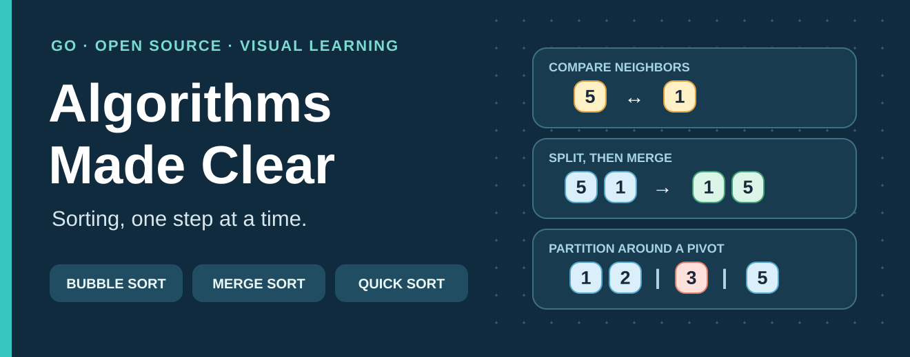
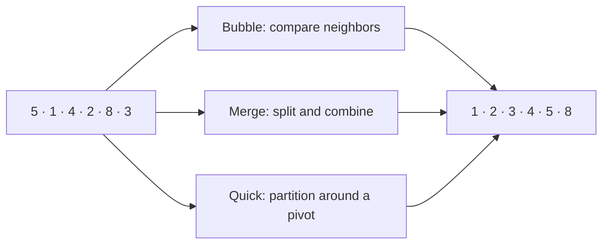

# Algorithms, Made Clear

**Sorting algorithms, explained through everyday stories, pictures, diagrams, and runnable Go.**

Books of different heights, a pile of receipts, and numbered pickup tickets can all be put in order. There is more than one way to do it: compare neighbors, sort smaller groups and combine them, or split items around a chosen reference number. Those are the ideas behind Bubble Sort, Merge Sort, and Quick Sort.



This first chapter covers **only three sorting algorithms**. Start with the story, follow the picture, then run the Go code. No mathematics is needed to begin.

## Sorting in one minute

Sorting puts items in a chosen order. Here, the rule is **smaller number first**:

```text
Before: 5  1  4  2  8  3
After:  1  2  3  4  5  8
```

For real items, decide what the number means: a book's height, a receipt's total, or a pickup ticket's number. The sorting algorithm follows that rule; it does not decide the rule for you.

| Algorithm | Picture to keep in mind | Read the visual guide |
| --- | --- | --- |
| **Bubble Sort** | Compare neighboring books by height; swap those in the wrong order. | [Bubble Sort](guides/bubble-sort.md) |
| **Merge Sort** | Split a pile of receipt totals, then combine sorted piles in order. | [Merge Sort](guides/merge-sort.md) |
| **Quick Sort** | Put pickup tickets on either side of one reference ticket; repeat within each side. | [Quick Sort](guides/quick-sort.md) |



## Which one should I choose?

| Algorithm | Best | Typical | Worst | Extra memory | Keeps equal items in their original order? |
| --- | --- | --- | --- | --- | --- |
| Bubble Sort | O(n) | O(n²) | O(n²) | O(1) | Yes |
| Merge Sort | O(n log n) | O(n log n) | O(n log n) | O(n) | Yes |
| Quick Sort here | O(n log n) | O(n log n) | O(n²) | O(log n) typical; O(n) worst, for recursion | No |

- **Learning the idea?** Start with Bubble Sort: every comparison is easy to see. It becomes slow as the list grows.
- **Need reliable performance and the original order of ties?** Merge Sort is a good model. It needs another array while sorting.
- **Want to see how partitioning can sort without a full second array?** Study Quick Sort. Its pivot choice matters: this teaching version chooses the last value, so already sorted or all-equal input can take O(n²) time.

“Stable” means ties keep their earlier order. If two receipts both total $20 and receipt A came before receipt B, a stable sort leaves A before B. “Extra memory” counts space beyond the original list; the Quick Sort row includes its recursive calls.

**For a real Go application, use the standard library** rather than these teaching implementations: [`slices.Sort`](https://pkg.go.dev/slices#Sort) for ordered values, [`slices.SortFunc`](https://pkg.go.dev/slices#SortFunc) for a custom comparison, or [`slices.SortStableFunc`](https://pkg.go.dev/slices#SortStableFunc) when ties must retain their original order. The `slices` package is part of Go's standard library starting with [Go 1.21](https://go.dev/doc/go1.21).

## Run the same example

Install Go 1.22 or newer, then run this from the repo root on **macOS, Linux, or Windows (PowerShell)**:

```sh
go run ./examples/sorting
```

```text
Before: [5 1 4 2 8 3]
Bubble: [1 2 3 4 5 8]
Merge : [1 2 3 4 5 8]
Quick : [1 2 3 4 5 8]
```

Each function changes the slice you pass to it. The example copies the starting values so that all three methods get the same input. Read the [Go implementations](sorting/sort.go) or run the checks with `go test ./...`.

## A few words you will meet

- **Pass:** one trip through the values being examined.
- **Pivot:** the reference value used to split a Quick Sort section.
- **O(n):** work grows roughly with the number of items. **O(n²):** roughly with its square. **O(n log n):** grows faster than O(n), but much slower than O(n²) for large lists. These describe growth, not exact seconds.
- **Stable:** items with equal sort values keep their earlier relative order.

The diagrams show the same numbers as the runnable code, so you can compare each step with the final output.

## License

[MIT](LICENSE)
