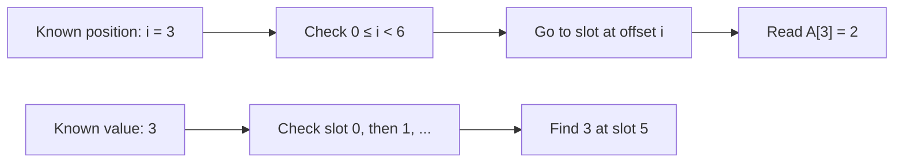

# Arrays: Find a Value by Its Position

![Six numbered slots hold 5, 1, 4, 2, 8, and 3; slot 3 holds 2, so A[3] equals 2.](../assets/arrays.svg)

**The idea:** An array keeps a fixed number of same-type values in numbered positions. If you know a position, you can go straight to its value.

## Picture it in everyday life

Imagine six lockers in a row, numbered **0** through **5**. Each locker holds one numbered card. To read locker 3, you do not need to open lockers 0, 1, and 2 first. But if you are looking for the *card marked 3* and do not know its locker, you may need to check every locker. **A position and the value stored there are different things.**

Our lockers hold `A = [5, 1, 4, 2, 8, 3]`:

| Position `i` | 0 | 1 | 2 | 3 | 4 | 5 |
| --- | ---: | ---: | ---: | ---: | ---: | ---: |
| Value `A[i]` | 5 | 1 | 4 | **2** | 8 | 3 |

The first position is **0**, not 1. Therefore `A[3] = 2`: position 3 is the **fourth** locker. The card marked `3` is at position **5**. Reading `A[6]` is invalid because the last valid position is `5`.

## Follow the positions

Start with the original row `A = [5, 1, 4, 2, 8, 3]`. Watch what each action changes:

| Action | Work | Result |
| --- | --- | --- |
| Read `A[3]` | Go directly to position 3. | Return `2`; `A` stays `[5, 1, 4, 2, 8, 3]`. |
| Set `A[3] = 7` | Replace the value in position 3. | `A` becomes `[5, 1, 4, 7, 8, 3]`. Its length stays `6`. |
| Find the value `3` | With no position given, inspect values from left to right. | After up to 6 checks, find `3` at position `5`. |



**What about inserting a new value?** Return to the *original* row. To insert `7` at position `2`, first make room, then move the existing values at positions `2` through `5` one place to the right. Move from the **right end toward the left** so a value is not overwritten before it has been moved:

```text
Original:       [5, 1, 4, 2, 8, 3]
Move 3 right:   [5, 1, 4, 2, 8, 3, 3]
Move 8 right:   [5, 1, 4, 2, 8, 8, 3]
Move 2 right:   [5, 1, 4, 2, 2, 8, 3]
Move 4 right:   [5, 1, 4, 4, 2, 8, 3]
Write 7 at 2:   [5, 1, 7, 4, 2, 8, 3]
```

Those are **4 shifted values**. The seven-place rows are possible with a Go *slice* whose length can grow, but **not inside the original `[6]int` array**: that array always has exactly six places. If the slice has no spare capacity, growing it may allocate a new backing array and copy existing values before the shift.

## Work out the rule

For `n` values, valid positions satisfy **`0 ≤ i < n`**. A direct read or replacement needs one valid index:

```text
READ(A, i):
    require 0 ≤ i < length(A)
    return A[i]

SET(A, i, value):
    require 0 ≤ i < length(A)
    A[i] = value
```

For an insertion into a *growable sequence* such as a Go slice, `i` may also equal `n` to append. The sequence must first have room for `n + 1` values:

```text
INSERT(S, i, value):
    require 0 ≤ i ≤ length(S)
    old_length = length(S)
    grow S by one slot, copying to larger storage if needed
    for j = old_length down to i + 1:
        S[j] = S[j - 1]
    S[i] = value
    return S
```

**Why does the shift work?** Moving from right to left preserves every source value until it is copied. After the loop, each original value at position `j ≥ i` is at `j + 1`, while positions before `i` have not changed. The new value fits at `i`. An insertion into a full fixed-size array requires a **different, larger array**; it does not change that array's type or length.

## The classroom math

Array elements occupy consecutive positions of the same element type. Conceptually, the location of element `i` is:

```text
location(A[i]) = base + i × element_size
```

`base` is the location of the first element. The element size depends on the type and platform; you do **not** need to know its byte count to use `A[i]` in Go. Computing an offset from a known index takes a fixed amount of work, so **read and update are `Θ(1)`**. Go still checks that an index is in bounds.

If you know only a value, there is no position to calculate. A left-to-right scan might check all `n` items, so its **worst case is `Θ(n)`**. For insertion at position `i` in a sequence of length `n`, the values from `i` through `n - 1` move: **`n - i` shifts**. Here `n = 6` and `i = 2`, so `6 - 2 = 4`. Deleting position `i` shifts **`n - i - 1`** later values left. The sequence itself stores **`Θ(n)` values**; a read or update needs `O(1)` extra space, while a growing slice may need a new backing array of `O(n)` space.

| Operation | Work in the worst case | Why? |
| --- | --- | --- |
| Read or update a known valid index | `Θ(1)` | Go can calculate the position directly. |
| Find an unknown value | `Θ(n)` | You may have to inspect every value. |
| Insert or delete near the front | `Θ(n)` | Later values must shift; growing may also copy. |

**Try it yourself:** In `[5, 1, 4, 2, 8, 3]`, what is `A[4]`? If you insert `9` at position `4` in a growable slice, which original values shift, and what is the result?

<details>
<summary>Check your answer</summary>

`A[4] = 8`. The original values `8` and `3` shift from positions `4` and `5` to positions `5` and `6`: **2 shifts**. The new sequence is `[5, 1, 4, 2, 9, 8, 3]`.

</details>

## Arrays and slices in Go

In Go, `[6]int` is an **array of exactly six integers**. Its length is part of its type, so `[6]int` and `[7]int` are different types. Assigning one array to another copies its elements:

```go
a := [6]int{5, 1, 4, 2, 8, 3}
b := a
b[3] = 7
// a[3] is still 2; b[3] is 7.
```

A `[]int` is a **slice**: a view of a segment of an underlying array. It has a length and capacity that may change as you use it. A slice derived from `a` shares `a`'s elements, so replacing a value through the slice also changes `a`:

```go
view := a[:]
view[3] = 9
// a[3] is now 9; b[3] is still 7.
```

`append` returns a slice with a new length. It reuses the underlying array if there is enough capacity, and may allocate a new one if there is not. Use the returned slice: `values = append(values, 9)`. For ordinary slice insertion, [`slices.Insert`](https://pkg.go.dev/slices#Insert) handles the shift; it also returns the resulting slice. The [Go specification](https://go.dev/ref/spec#Array_types) defines arrays and slices, and the [Go slices guide](https://go.dev/blog/slices-intro) illustrates their storage and copy behavior.

Copying an array of `n` elements, as `b := a` does, copies **`n` values (`Θ(n)` work)**. Assigning a slice copies only its small descriptor (`Θ(1)` work), but the two slices can still refer to the same elements. This is a separate cost from reading one indexed element.

## When should you use it?

Use an array when the number of same-type values is **known and fixed**, such as six readings that must always be present, and value-copy behavior is appropriate. In most Go code where the number of values can change, use a **slice**. Both allow direct indexed reads; neither makes an unsorted value magically searchable without inspecting it. If you know the value but not its position, revisit [Linear Search](linear-search.md).

**Try the Go code:** Run `go run ./examples/data-structures` from the repo root on **macOS, Linux, or Windows (PowerShell)**, then compare the output with [the runnable example](../examples/data-structures/main.go).
