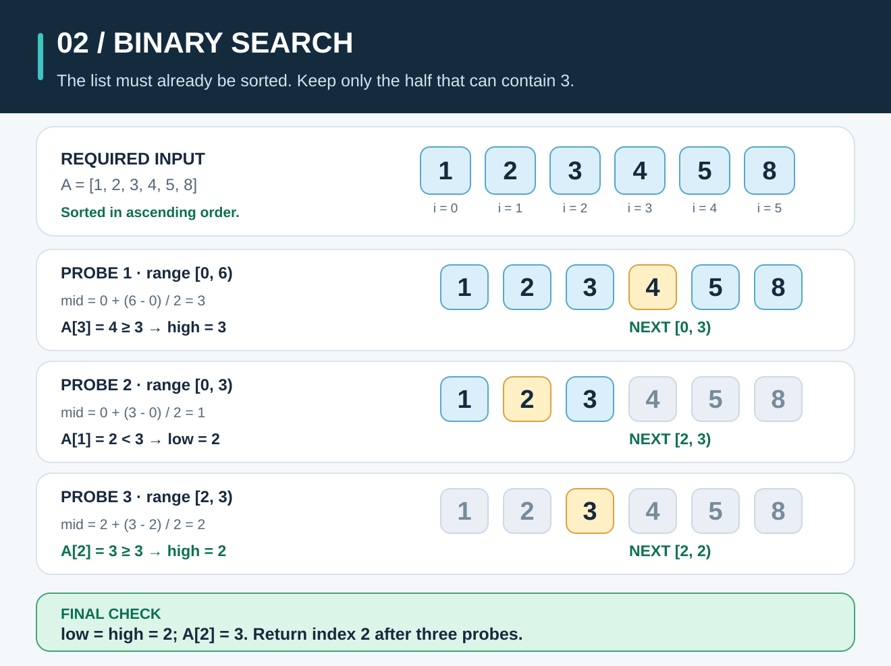
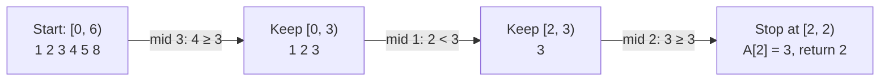

# Binary Search: Keep the Half That Can Hold the Answer



**The idea:** In a **sorted** list, compare the middle value with the one you want. Keep only the half that could contain the answer. Repeat until you have one possible position.

## Picture it in everyday life

Imagine a library shelf whose book labels run from smallest to largest. You want book `3`. A book near the middle is labeled `4`, so book `3` must be to its left. In that smaller section, you find `2`, so book `3` must be to its right. One more check finds where `3` belongs.

This shortcut depends on the labels being **in order**. If the books are scattered, finding `4` tells you nothing about where `3` is. In that case, check the books one by one with [Linear Search](linear-search.md).

## Follow the positions

Use the sorted slice `A = [1, 2, 3, 4, 5, 8]` and look for `target = 3`. Go counts positions from `0`:

| Position `i` | 0 | 1 | 2 | 3 | 4 | 5 |
| --- | ---: | ---: | ---: | ---: | ---: | ---: |
| Value `A[i]` | 1 | 2 | 3 | 4 | 5 | 8 |

The current search range is written **`[low, high)`**. It includes `low` but excludes `high`. We start with `[0, 6)`, so all six positions are possible; `high = 6` is a boundary, **not** a position we read. Choose `mid = low + ⌊(high - low)/2⌋`, where `⌊ ⌋` means round down.

| Step | Range before check | `mid` calculation | Middle value | Decision | Range afterward |
| --- | --- | --- | --- | --- | --- |
| 1 | `[0, 6)` | `0 + ⌊6/2⌋ = 3` | `A[3] = 4` | `4 > 3`, so any match lies before position 3. Set `high = 3`. | `[0, 3)` |
| 2 | `[0, 3)` | `0 + ⌊3/2⌋ = 1` | `A[1] = 2` | `2 < 3`; the answer must be later. Set `low = 2`. | `[2, 3)` |
| 3 | `[2, 3)` | `2 + ⌊1/2⌋ = 2` | `A[2] = 3` | Position 2 may be the first match. Set `high = 2`; it becomes the answer boundary. | `[2, 2)` |

Now `low = high = 2`: there are no positions left to test. The final check confirms `A[2] == 3`, so **the result is index `2`**. The loop made **three middle-value comparisons** (`A[mid] < target`), followed by **one equality check** (`A[low] == target`). Index `2` is the third item because indexing begins at zero.



## Work out the rule

This version finds the **first** matching index. If the target appears more than once, finding *a* match in the middle is not enough: an earlier match may still be on the left. That is why `A[mid] >= target` moves `high` to `mid` instead of returning immediately.

```text
BINARY_SEARCH(A, target):
    low = 0
    high = length(A)          // high is excluded
    while low < high:
        mid = low + floor((high - low) / 2)
        if A[mid] < target:
            low = mid + 1
        else:
            high = mid
    if low < length(A) and A[low] == target:
        return low
    return -1
```

**Why is this correct?** Before and after every loop step, all values **before** `low` are smaller than the target, and all values **at or after** `high` are at least the target. Sorted order makes each update safe:

- If `A[mid] < target`, every value at or before `mid` is also too small. Set `low = mid + 1`.
- Otherwise `A[mid] >= target`, so `mid` might be the first suitable position, but nothing after it can be earlier. Set `high = mid`.

When `low == high`, that position is the first place a value **at least** as large as the target could go. It might be an actual match, a larger value, or `length(A)` if the target is larger than every item. The final bounds and equality checks distinguish those cases. For an empty slice, the loop never runs and the result is `-1`.

For example, with `[1, 2, 2, 2, 5]` and target `2`, the ranges shrink `[0, 5) → [0, 2) → [0, 1) → [1, 1)`. The answer is **index `1`**, the first `2`.

## The classroom math

Let `n` be the number of values. Every middle check discards roughly half the remaining positions. After `k` checks, at most about `n/2ᵏ` positions remain. We stop when this falls below `1`, so solving `n/2ᵏ < 1` gives `k > log₂ n`. Here `log₂ n` means “how many times can we halve `n` before reaching about one?”

For the worst-case work, an upper-bound recurrence is:

```text
T(n) ≤ T(⌈n/2⌉) + Θ(1), for n > 1
T(0) = T(1) = Θ(1)
```

The `Θ(1)` is one midpoint calculation and comparison; `⌈ ⌉` means round up. Halving through about `log₂ n` levels gives **`Θ(log n)` time** for this first-match implementation when `n` grows. It still narrows to the first possible position even if a middle value equals the target, so its best and worst cases are both `Θ(log n)` for large `n`. An early-return classroom variant can finish in `Θ(1)` best-case time when it lands on the target immediately, but it does not automatically return the *first* duplicate. Both versions use **`O(1)` extra space** with a loop.

**Try it yourself:** Search for `6` in `[1, 2, 3, 4, 5, 8]`. Write the range, midpoint, and middle value after each step. What does the final equality check return?

<details>
<summary>Check your answer</summary>

The checks are `[0, 6)` with `mid = 3`, value `4` → `[4, 6)`; `[4, 6)` with `mid = 5`, value `8` → `[4, 5)`; then `[4, 5)` with `mid = 4`, value `5` → `[5, 5)`. Position `5` holds `8`, not `6`, so the result is **`-1`**. The final position `5` is where `6` *could be inserted* to keep the order.

</details>

## When should you use it?

Use binary search when the data is **already sorted by the same value you are searching for**, especially when you will search it many times. The slice is read without changing it. For one search through an unsorted list, [Linear Search](linear-search.md) is usually simpler: sorting first adds `O(n log n)` work with a typical comparison sort, while one scan needs `O(n)` work, and sorting may change positions you care about. With many searches on unchanged data, the sorting cost can be shared.

| Property | This implementation |
| --- | --- |
| Input | Numbers sorted in ascending order; duplicates are allowed |
| Result | First matching index, or `-1` if absent |
| Time | `Θ(log n)` best and worst as `n` grows for this first-match version |
| Extra space | `O(1)`; it uses only a few indices |

For an ordinary Go program, use the standard library's [`slices.BinarySearch`](https://pkg.go.dev/slices#BinarySearch) on sorted data. It also finds the earliest matching position, but returns **`(index, found)`**; when absent, `index` is the insertion position and `found` is `false`, rather than returning `-1`.

**Try the Go code:** [searching/search.go](../searching/search.go). Try duplicate values and an absent value; the input must stay in ascending order.
