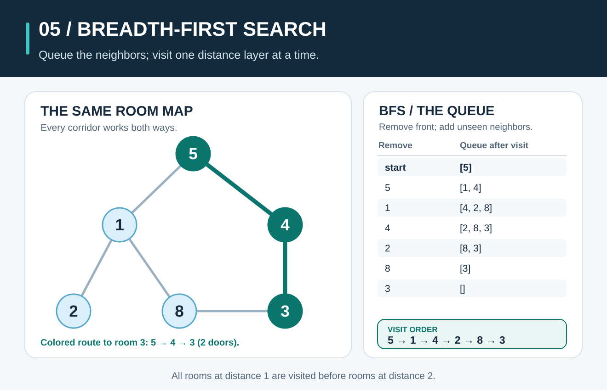
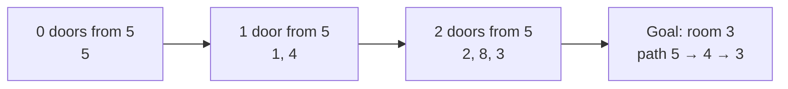

# Breadth-First Search: Explore the Nearest Rooms First



**The idea:** Breadth-first search (BFS) visits a starting point, then all its immediate neighbors, then their unvisited neighbors. A **queue** keeps the rooms waiting in first-in, first-out order. The first route BFS finds to a room uses the fewest doors; if every door has the same cost, it is also a cheapest route.

## Picture it in everyday life

Imagine six numbered rooms in a museum. Doors join some pairs of rooms, and you are standing in room **5**, looking for room **3**. You can walk through each door in either direction. To find a route with the fewest doors, first check every room one door from 5; only then check rooms two doors away. That is BFS.

The numbers are **room labels**, not values to sort. The order in which we list a room's doors decides which equally short route BFS finds first. We use this same graph in the [Depth-First Search](depth-first-search.md) guide, so you can compare the two methods directly.

| Room | Doors to other rooms, in the order we check them |
| ---: | --- |
| 5 | 1, 4 |
| 1 | 5, 2, 8 |
| 4 | 5, 3 |
| 2 | 1 |
| 8 | 1, 3 |
| 3 | 4, 8 |

For example, `5—1` is one door, and it appears in both rooms' lists because the door works both ways. The six distinct doors are `5—1`, `5—4`, `1—2`, `1—8`, `4—3`, and `8—3`. They form a **graph**: rooms are *vertices* (or *nodes*), and doors are *edges*.

## Follow the queue

Start with queue `[5]` and mark 5 as **visited**. Each step removes the front room. Add its unvisited neighbors to the back of the queue **in the order listed above**, marking them visited as soon as they are added. That prevents a room reached through two doors from entering the queue twice.

| Step | Room removed | New rooms added | Queue afterward | First route recorded for a new room |
| ---: | ---: | --- | --- | --- |
| 1 | 5 | 1, 4 | `[1, 4]` | `5 → 1`, `5 → 4` |
| 2 | 1 | 2, 8 | `[4, 2, 8]` | `5 → 1 → 2`, `5 → 1 → 8` |
| 3 | 4 | 3 | `[2, 8, 3]` | `5 → 4 → 3` |
| 4 | 2 | None | `[8, 3]` | — |
| 5 | 8 | None; 3 was already marked | `[3]` | — |
| 6 | 3 | None | `[]` | — |

The **removal order** is `5, 1, 4, 2, 8, 3`. This implementation walks the whole reachable part of the graph, even though it first discovers the requested room 3 at step 3. It records `parent[3] = 4` and `parent[4] = 5`; following those parents backward and reversing the result gives **`5 → 4 → 3`**, a route through **2 doors**.



These layers describe distance by **number of doors**, not the numerical difference between labels. Room 4 is one door from room 5 even though their labels differ by one; room 3 is two doors away even though `5 − 3 = 2` happens to match by coincidence.

## Work out the rule

An *adjacency list* stores each room's neighbors, as in the table above. The pseudocode below also records the room from which each new room was first found:

```text
BFS(graph, start, goal):
    queue = [start]
    visited = {start}
    parent = empty map
    order = []

    while queue is not empty:
        room = remove front of queue
        append room to order
        for next in graph[room], in listed order:
            if next is not visited:
                mark next visited
                parent[next] = room
                add next to back of queue

    if goal was not visited:
        return order, no path
    return order, path from start to goal using parent
```

**Why does this find a route with the fewest doors?** Let `d(v)` be the minimum number of doors from the start to room `v`. The start has `d(5) = 0`. The queue processes all rooms first discovered at distance `k` before rooms first discovered at distance `k + 1`. When a room at distance `k` discovers an unvisited neighbor, it records a route of `k + 1` doors. If a shorter route to that neighbor existed, its previous room would have been processed in an earlier layer and would already have discovered it. Therefore the first recorded route is shortest **by edge count**.

For this graph:

```text
d(5) = 0
d(1) = d(4) = 1
d(2) = d(8) = d(3) = 2
```

The route to 3 has `d(3) = 2`: three rooms appear on the route, but there are only **two edges** between them. BFS always minimizes the **number of doors**. If doors take different amounts of time, the fewest-door route need not be the fastest; finding the lowest total cost requires a method that uses edge costs.

## The classroom math

Let `V` be the number of reachable rooms and `E` the number of distinct doors among them. A room is added to the queue once and removed once: `V` queue operations of each kind. Checking its list scans each directed neighbor entry once. An undirected door appears twice in the lists, so there are `2E` neighbor checks. The work is therefore **`O(V + E)` time**, and the queue, visited set, parents, and returned order use **`O(V)` space**. In this example, `V = 6`, `E = 6`, and a complete walk checks **12 neighbor entries**. Hash-map operations in the Go implementation are treated as expected `O(1)` for this analysis.

**Try it yourself:** Keep the same door order, but ask for room **8** instead of room 3. At which layer is it found? Which route and how many doors does BFS return?

<details>
<summary>Check your answer</summary>

Room 8 is first discovered from room 1, in the **two-door layer**. Its recorded route is `5 → 1 → 8`, using **2 doors**. The full removal order remains `5, 1, 4, 2, 8, 3` because only the requested goal changed.

</details>

## When should you use it?

Use BFS to find a route with the **fewest steps** in an unweighted graph, or to explore everything within a fixed number of steps: for example, which pages can be reached through one or two links. If you only need to explore all reachable rooms and the route length does not matter, [Depth-First Search](depth-first-search.md) is another choice.

**Try the Go code:** Read [the BFS implementation](../graphsearch/walk.go) and [runnable graph example](../examples/graph-search/main.go). From the repository root on **macOS, Linux, or Windows (PowerShell)**, run:

```sh
go run ./examples/graph-search
```

Look for the BFS visit order and the route from 5 to 3. Then run `go test ./...` and try changing the goal to 8.
