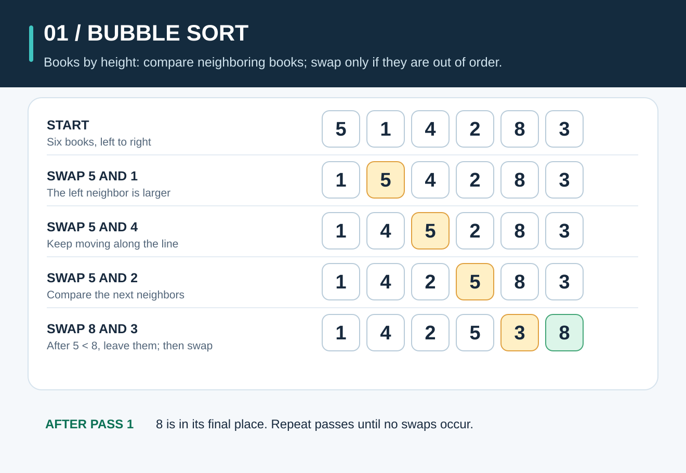
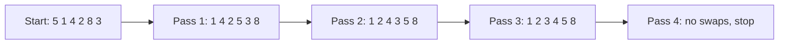

# Bubble Sort: Swap Neighbors Until Everything Is in Order

**The idea:** Walk along a row, compare two neighbors, and swap them when they are in the wrong order. Repeat until a whole walk makes no swaps.

## Picture it in everyday life

Imagine six books on a shelf, each marked with its height in the same units. You want to arrange them from shortest to tallest. Compare two books beside each other. If the one on the left is taller, switch them. After one walk from left to right, the tallest book has reached the end. Repeat with the remaining books.

That is bubble sort. It is an easy way to *see* how sorting works, though it is usually a poor choice for a large list.

## Follow the books

We want to sort `[5, 1, 4, 2, 8, 3]` from smallest to largest. Each line below shows the row **after** a complete walk, or *pass*.

| Pass | Row | What happened? |
| --- | --- | --- |
| Start | `[5, 1, 4, 2, 8, 3]` | Nothing has moved yet. |
| 1 | `[1, 4, 2, 5, 3, 8]` | `8` reached its final place. |
| 2 | `[1, 2, 4, 3, 5, 8]` | `5` reached its final place. |
| 3 | `[1, 2, 3, 4, 5, 8]` | The whole row is now sorted. |
| 4 | `[1, 2, 3, 4, 5, 8]` | No swaps: stop. |

For a closer look at pass 1, the first comparison swaps `5` and `1`: `[1, 5, 4, 2, 8, 3]`. Later, the last comparison swaps `8` and `3`, leaving `8` at the end.

**Why does this work?** In each pass, a larger value moves right whenever it meets a smaller neighbor. The largest value still out of place must therefore reach the end of the unsorted part. That part gets shorter after every pass.

## When should you use it?

Use bubble sort to learn comparisons, swaps, and why repeated work matters. It can be fine for arranging a few books by hand. For ordinary Go programs, use [`slices.Sort`](https://pkg.go.dev/slices#Sort) instead of writing bubble sort for production data.

| Property | This implementation |
| --- | --- |
| Time | Best `O(n)` when already sorted, because it stops after a pass with no swaps; average and worst `O(n²)` |
| Extra space | `O(1)`; swaps happen in the original slice |
| Stable? | Yes. It swaps only when the left value is **greater than** the right value, so equal values keep their original order. |

Here, `n` is the number of items. `O(n²)` means the work grows quickly as the list gets longer; it does not mean the algorithm is wrong.

**Try the Go code:** [sorting/sort.go](../sorting/sort.go). Change the sample to an already sorted row and see the early stop.
