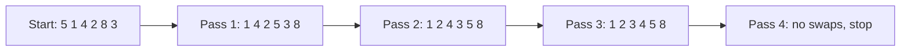

# Bubble Sort: Swap Neighbors Until Everything Is in Order


**The idea:** Walk along a row, compare two neighbors, and swap them when they are in the wrong order. Repeat until a whole walk makes no swaps.

## Picture it in everyday life

Imagine six books on a shelf, each marked with its height in the same units. You want to arrange them from shortest to tallest. Compare two books beside each other. If the one on the left is taller, switch them. After one walk from left to right, the tallest book has reached the end. Repeat with the remaining books.

That is bubble sort. It is an easy way to *see* how sorting works, though it is usually a poor choice for a large list.

## Follow the books

We want to sort `[5, 1, 4, 2, 8, 3]` from smallest to largest. Each line below shows the row **after** a complete walk, or *pass*. A comparison checks two neighboring values; a swap changes their places.

| Pass | Row | Comparisons | Swaps | What happened? |
| --- | --- | ---: | ---: | --- |
| Start | `[5, 1, 4, 2, 8, 3]` | 0 | 0 | Nothing has moved yet. |
| 1 | `[1, 4, 2, 5, 3, 8]` | 5 | 4 | `8` reached its final place. |
| 2 | `[1, 2, 4, 3, 5, 8]` | 4 | 2 | `5` reached its final place. |
| 3 | `[1, 2, 3, 4, 5, 8]` | 3 | 1 | The whole row is now sorted. |
| 4 | `[1, 2, 3, 4, 5, 8]` | 2 | 0 | No swaps: stop. |

**Predict:** On the first pass, which value will finish at the far right? Follow every comparison to check your answer:

| Compared positions (from 0) | Values | Action | Row afterward |
| --- | --- | --- | --- |
| 0 and 1 | `5 > 1` | Swap | `[1, 5, 4, 2, 8, 3]` |
| 1 and 2 | `5 > 4` | Swap | `[1, 4, 5, 2, 8, 3]` |
| 2 and 3 | `5 > 2` | Swap | `[1, 4, 2, 5, 8, 3]` |
| 3 and 4 | `5 < 8` | Keep | `[1, 4, 2, 5, 8, 3]` |
| 4 and 5 | `8 > 3` | Swap | `[1, 4, 2, 5, 3, 8]` |

**Result:** `8` is at the far right. Across all four passes, the code made `5 + 4 + 3 + 2 = 14` comparisons and `4 + 2 + 1 + 0 = 7` swaps.



## Work out the rule

Let `n` be the number of values. Positions start at `0`, so the last position is `n - 1`. Each pass compares positions `i` and `i + 1` while `i` moves from `0` to `end - 1`. After a pass, `end` moves one position left because the value at `end` is finished. Thus pass `p` (counting from 1) makes `n - p` comparisons if the algorithm reaches it.

```text
for end = n - 1 down to 1:
    swapped = false
    for i = 0 up to end - 1:
        if A[i] > A[i + 1]:
            swap A[i] and A[i + 1]
            swapped = true
    if swapped is false: stop
```

**Why it is correct:** During a pass, the largest value in positions `0` through `end` moves right whenever it meets a smaller neighbor. It finishes at `end`. After pass 1, the last position is correct; after pass 2, the last two positions are correct; and so on. This is the *pass invariant*: after `p` passes, the last `p` positions hold the `p` largest values in sorted order. If a pass makes no swaps, the remaining positions are already sorted, so the algorithm can stop.

**How much work?** An already sorted row needs just `n - 1` comparisons (for `n >= 2`) and no swaps: `O(n)` time. In the worst case, the passes use `(n - 1) + (n - 2) + ... + 1 = n(n - 1)/2` comparisons: `O(n²)` time. The average case is also `O(n²)`. Only a few counters and a swap flag are needed alongside the original row: `O(1)` extra space.

**Try it yourself:** Start with `[3, 1, 2]`. Predict the row after one pass, then calculate each neighboring comparison. **Check:** `3 > 1` gives `[1, 3, 2]`; `3 > 2` gives `[1, 2, 3]`. The pass made 2 comparisons and 2 swaps.

## When should you use it?

Use bubble sort to learn comparisons, swaps, and why repeated work matters. It can be fine for arranging a few books by hand. For ordinary Go programs, use [`slices.Sort`](https://pkg.go.dev/slices#Sort) instead of writing bubble sort for production data.

| Property | This implementation |
| --- | --- |
| Time | Best `O(n)` when already sorted, because it stops after a pass with no swaps; average and worst `O(n²)` |
| Extra space | `O(1)`; swaps happen in the original slice |
| Stable? | Yes. It swaps only when the left value is **greater than** the right value, so equal values keep their original order. |

Here, `n` is the number of items. `O(n²)` means the work grows quickly as the list gets longer; it does not mean the algorithm is wrong.

**Try the Go code:** [sorting/sort.go](../sorting/sort.go). Change the sample to an already sorted row and see the early stop.
