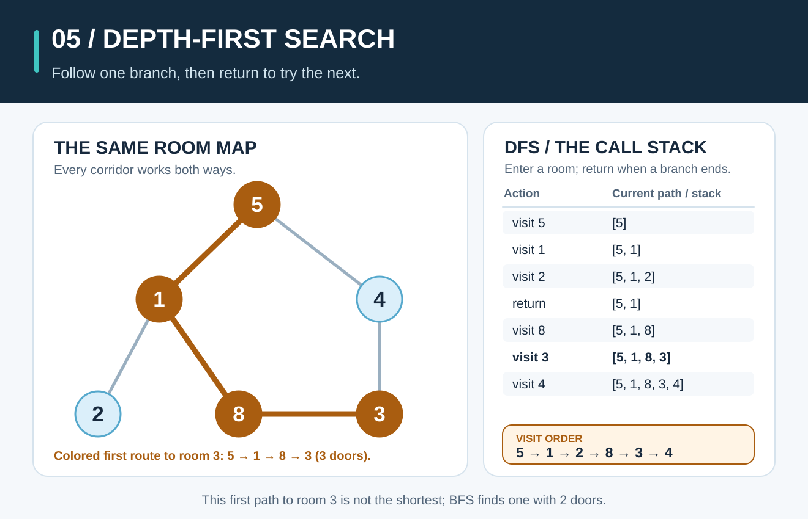
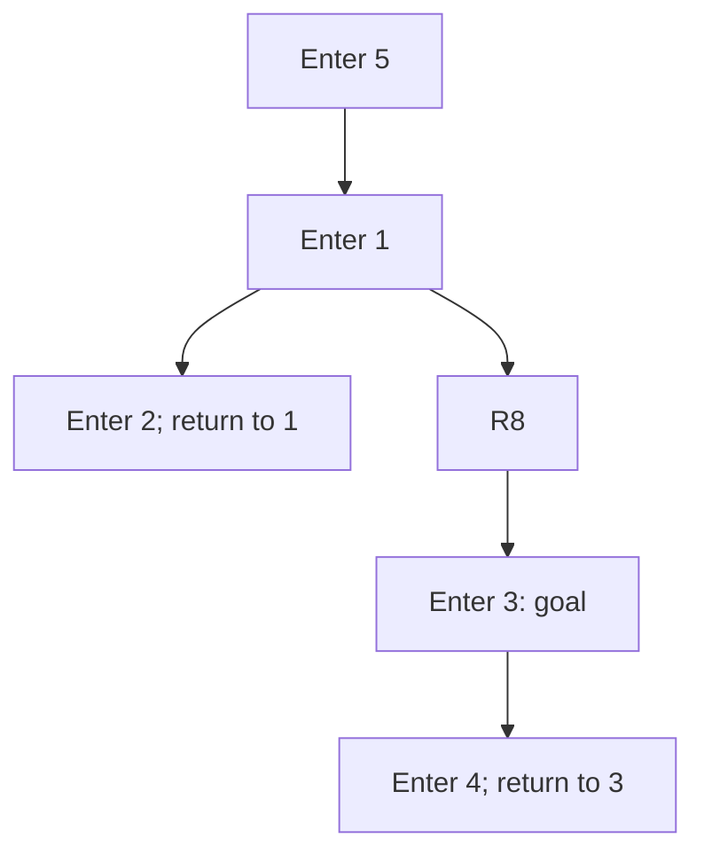

# Depth-First Search: Follow a Route, Then Backtrack



**The idea:** Depth-first search (DFS) follows the first unvisited neighbor as far as it can. When a room offers no unvisited door, it **backtracks** to the most recent room with another choice. A recursive function can remember those waiting choices on the call stack.

## Picture it in everyday life

Imagine exploring six numbered museum rooms. From room **5**, take its first listed door to 1. From 1, take its first unvisited door to 2. Room 2 leads only back to 1, so you return to 1 and try its next unvisited door, toward 8. This is the depth-first habit: finish one route before trying another.

Doors work both ways. The room numbers are **labels**, not values to sort. We use the same graph as [Breadth-First Search](breadth-first-search.md), with exactly this door-checking order:

| Room | Doors to other rooms, in the order we check them |
| ---: | --- |
| 5 | 1, 4 |
| 1 | 5, 2, 8 |
| 4 | 5, 3 |
| 2 | 1 |
| 8 | 1, 3 |
| 3 | 4, 8 |

## Follow the calls and returns

Mark a room **visited when entering it**. That matters here: the doors `5—1—8—3—4—5` form a cycle. Without a visited set, you could keep walking around it forever. After entering a room, examine its neighbors in the listed order. A visited neighbor needs no new call.

| Moment | Action | Why? |
| ---: | --- | --- |
| 1 | Enter **5** | Start here. Its first neighbor is 1. |
| 2 | Enter **1** | Skip visited 5; try 2. |
| 3 | Enter **2** | Its only neighbor, 1, is visited; **return to 1**. |
| 4 | Enter **8** | This is 1's next unvisited neighbor. Skip visited 1; try 3. |
| 5 | Enter **3** | Its first neighbor is 4. |
| 6 | Enter **4** | Both 5 and 3 are visited; **return to 3**. |
| 7 | Return through **3 → 8 → 1 → 5** | All remaining neighbors are visited, including 4 from room 5. |

The **entry order**, also called *preorder*, is **`5, 1, 2, 8, 3, 4`**. The calls return in a different order because DFS must finish a branch before coming back. The implementation records a parent when each new room is discovered. For goal **3**, those parents give **`5 → 1 → 8 → 3`**, a route through **3 doors**. It completes the walk after reaching 3, so room 4 also appears in the returned entry order.



The diagram shows the **discovery tree**, not every door in the original graph. For instance, door `5—4` is absent from this tree because DFS first reached 4 through `5 → 1 → 8 → 3 → 4`.

## Work out the rule

```text
DFS(graph, start, goal):
    visited = empty set
    parent = empty map
    order = []

    VISIT(room):
        mark room visited
        append room to order
        for next in graph[room], in listed order:
            if next is not visited:
                parent[next] = room
                VISIT(next)

    VISIT(start)
    if goal was not visited:
        return order, no path
    return order, path from start to goal using parent
```

The **base action** is implicit: when a room has no unvisited neighbor, its call returns. Each recursive call visits a **new** room, so a graph with a finite number of rooms cannot produce an endless chain of new calls. The visited set also blocks cycles.

**Why does DFS visit every reachable room?** Each room is entered at most once. When DFS finishes a room, it has examined every door from it: any neighbor that was unvisited was entered recursively, and any visited neighbor was already reached. If some reachable room were never visited, a route from 5 to it would have a first door from a visited room to an unvisited room. DFS would have followed that door, a contradiction. Parent links therefore give a valid route to every reached room.

That route is **not guaranteed to use the fewest doors**. Here DFS's first route to 3 is `5 → 1 → 8 → 3` (**3 doors**), while the route `5 → 4 → 3` uses only **2 doors**. BFS finds the two-door route because it explores by distance layers. Changing the order of neighbors can also change DFS's entry order and first route.

## The classroom math

Let `V` be the number of reachable rooms and `E` the number of distinct doors among them. Each room is entered once. Across all calls, the loops examine each adjacency-list entry once, or `2E` entries for an undirected graph. Thus DFS takes **`O(V + E)` time**. The visited set, parents, returned order, and recursive call stack take **`O(V)` space**. In this graph, `V = 6`, `E = 6`, so a complete walk enters **6 rooms** and checks **12 neighbor entries**. Hash-map operations in the Go implementation are treated as expected `O(1)` for this analysis.

The deepest call chain here is `5 → 1 → 8 → 3 → 4`, with **5 active calls**. For a long single chain of `V` rooms, recursion may need `V` active calls; an explicit stack can be useful if that depth is a concern. This is stack **space**, separate from the graph's own storage.

**Try it yourself:** When DFS enters room **2**, why does it return to room 1? After the complete walk, what happens when room 5 finally checks its other door to room 4? Does DFS's route to room 3 use the fewest doors?

<details>
<summary>Check your answer</summary>

Room 2's only neighbor is room 1, which was marked visited before entering 2; the call returns to 1. By the time DFS comes back to room 5, room 4 has already been visited through room 3, so it is skipped. DFS's recorded route to 3 uses **3 doors**; `5 → 4 → 3` uses **2**.

</details>

## When should you use it?

Use DFS when you want to explore a connected area, inspect paths, or process every reachable node and the first route does not need to be shortest. Its go-deeper-then-return pattern also appears in tree traversal and backtracking problems. Use [Breadth-First Search](breadth-first-search.md) when the goal is a route with the fewest doors. If doors have different costs, the fewest-door route may not have the lowest total cost.

**Try the Go code:** Read [the DFS implementation](../graphsearch/walk.go) and [runnable graph example](../examples/graph-search/main.go). From the repository root on **macOS, Linux, or Windows (PowerShell)**, run:

```sh
go run ./examples/graph-search
```

Compare the BFS and DFS routes to room 3. Then run `go test ./...` and change the neighbor order at room 1 to see which DFS room is entered next.
