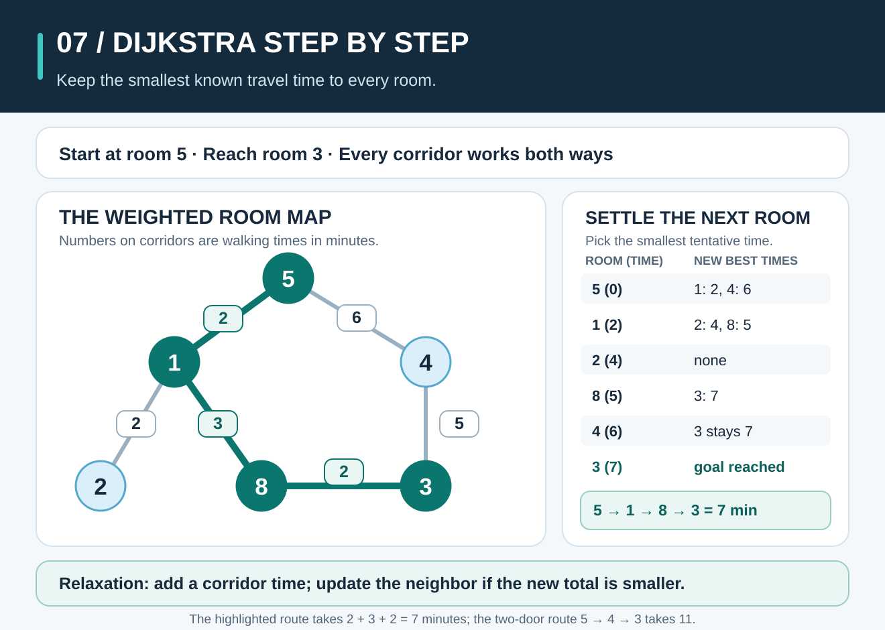
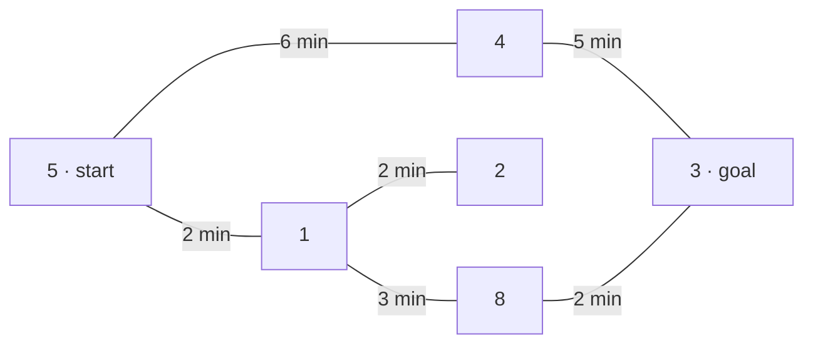

# Dijkstra's Algorithm: Find the Fastest Route



**The idea:** Dijkstra's algorithm finds a route with the smallest **total cost** from a starting point when every connection has a **nonnegative** cost. It repeatedly chooses the room with the smallest known travel time and checks whether going through that room improves a route to its neighbors.

## Picture it in everyday life

You are in room **5** of a museum and want to reach room **3**. The six rooms and their doors are the same as in [Breadth-First Search](breadth-first-search.md). Now each door has a walking time. You may use each door in either direction; the numbers on the rooms are labels, not distances or times.

| Door | Walking time |
| --- | ---: |
| `5—1` | 2 minutes |
| `5—4` | 6 minutes |
| `1—2` | 2 minutes |
| `1—8` | 3 minutes |
| `4—3` | 5 minutes |
| `8—3` | 2 minutes |



[BFS](breadth-first-search.md) finds `5 → 4 → 3`, just **2 doors**, but it takes `6 + 5 = 11` minutes. Dijkstra finds `5 → 1 → 8 → 3`, **3 doors** but only `2 + 3 + 2 = 7` minutes. The question changed from “How many doors?” to “How many minutes?” That makes the best route change too.

## Build the answer one room at a time

Let `d(v)` be the shortest travel time **found so far** from room 5 to room `v`. Start with `d(5) = 0` and `d(v) = ∞` for every other room. `∞` means we do not yet know a route, not that a walk literally takes infinite time. Keep the rooms with tentative times in a **min-priority queue**: it gives us the room with the smallest tentative time next.

When we take room `u` out with its current best time, we **settle** it: that time is final. For each door from `u` to `v` with walking time `w(u, v)`, try this possible improvement, called **relaxation**:

```text
candidate = d(u) + w(u, v)
d(v) = min(d(v), candidate)
```

If `candidate` improves `d(v)`, also record `parent[v] = u`. The parent says which room to come from on our currently best route. We accept a new proposal only when it is smaller than the current one. Here, the 7-minute route through room 8 is found first; the later 11-minute proposal through room 4 is rejected. Discovering a room does **not** settle it.

| Room settled | `d(5)` | `d(1)` | `d(2)` | `d(8)` | `d(4)` | `d(3)` | What changed? |
| ---: | ---: | ---: | ---: | ---: | ---: | ---: | --- |
| Start | **0** | ∞ | ∞ | ∞ | ∞ | ∞ | Only room 5 is known. |
| **5** | 0 | **2** | ∞ | ∞ | **6** | ∞ | Try `5→1` and `5→4`. |
| **1** | 0 | 2 | **4** | **5** | 6 | ∞ | `2 + 2 = 4` to room 2; `2 + 3 = 5` to room 8. |
| **2** | 0 | 2 | 4 | 5 | 6 | ∞ | No better route through the dead end. |
| **8** | 0 | 2 | 4 | 5 | 6 | **7** | `5 + 2 = 7` to room 3; set `parent[3] = 8`. |
| **4** | 0 | 2 | 4 | 5 | 6 | 7 | `6 + 5 = 11` to room 3 is worse than 7. |
| **3** | 0 | 2 | 4 | 5 | 6 | **7** | Goal settled: stop. |

The settled order is **`5, 1, 2, 8, 4, 3`**, with final times `0, 2, 4, 5, 6, 7` in that order. Notice that room 4 is only one door from the start, but it is settled after rooms 2 and 8 because its **time** of 6 minutes is greater than 4 and 5 minutes.

To recover the route, follow parents **backward**: `3 ← 8 ← 1 ← 5`. Reverse that list to get `5 → 1 → 8 → 3`. The algorithm keeps the best time and enough parent information to return this route. If the goal cannot be reached, the Go function returns a cost of `-1` and no path.

## Work out the rule

```text
Dijkstra(graph, start, goal):
    check that every door cost is nonnegative
    d(start) = 0; all other tentative times = infinity
    priority queue = [(0, start)]
    parent = empty map

    while priority queue is not empty:
        remove room u with the smallest tentative time
        if this entry is older than the current d(u): skip it
        if u is goal: reconstruct the route from parent and return d(u)
        for each door (u, v) with cost w:
            candidate = d(u) + w
            if candidate < d(v):
                d(v) = candidate
                parent[v] = u
                add (candidate, v) to priority queue

    return no route
```

The Go version uses [`container/heap`](https://pkg.go.dev/container/heap). When a better time is found, it adds a new queue entry; the old entry may remain and is skipped when removed. This keeps the code simple without a special “decrease key” operation. A room is only processed using its current best time.

Go stores the total in an `int`. If every route to a reachable goal costs more than `int` can represent, the function returns an error instead of wrapping around. An overflowing detour does not hide a cheaper route whose total fits in `int`.

**Why is a settled time final?** Suppose the next room chosen is `u`, with the smallest tentative time. Imagine that a faster route to `u` exists. On that faster route, look at the **first unsettled room** `v`. Its previous room was already settled, so checking their connecting door would have offered `v` a tentative time no greater than the route's time up to `v`. Because all remaining door costs are nonnegative, that prefix cannot cost more than the whole supposedly faster route. Then `v` would have a tentative time smaller than `d(u)`, contradicting our choice of `u` as the smallest. So `d(u)` is truly shortest when we settle it. Repeat this argument for each room; we may safely stop once the goal is settled.

This argument depends on **nonnegative** door times. A negative edge could make a route cheaper after a room had already been settled. The Go function rejects a graph containing any negative cost, even if that door is elsewhere in the graph.

## The classroom math

Let `V` be the number of rooms and `E` the number of door entries in the adjacency lists. Each room's outgoing entries are inspected when that room is processed, so there are `O(E)` edge checks. Every successful improvement can add a queue entry, giving at most `O(E + 1)` entries over the run; each heap insertion or removal takes `O(log(V + E))` time. This **lazy-entry implementation** therefore takes **`O((V + E) log(V + E))` time** in the worst case and **`O(V + E)` extra space** for the maps and heap. It also scans the input edges once up front to reject negative costs; if an overflowing candidate was skipped and no finite route was found, it makes one `O(V + E)` reachability check. Here each of six two-way doors appears twice, so `V = 6` and `E = 12` directed entries. These bounds use expected constant-time Go map operations.

The total travel time along a path `P` is the sum of its door weights:

```text
cost(P) = Σ w(u, v) for every door (u, v) on P
cost(5 → 4 → 3) = 6 + 5 = 11
cost(5 → 1 → 8 → 3) = 2 + 3 + 2 = 7
```

The number of doors and the sum of door times are different measurements. Pick the one your actual question asks you to minimize.

**Try it yourself:** From room **5**, what is the quickest route to room **2**, and how many minutes does it take? What if the walking time between rooms `8` and `3` rises from 2 to **8** minutes: which route from 5 to 3 becomes fastest?

<details>
<summary>Check your answer</summary>

To room 2, take `5 → 1 → 2` in `2 + 2 = 4` minutes. With `8—3` raised to 8 minutes, `5 → 1 → 8 → 3` costs `2 + 3 + 8 = 13`, so `5 → 4 → 3` becomes fastest at **11 minutes**.

</details>

## When should you use it?

Use Dijkstra when connections have **different, known, nonnegative costs** and you need a least-cost route: walking minutes between rooms, data transfer delays between network nodes, or delivery travel estimates on a fixed network. The route is only as useful as its cost data; changing conditions call for updated weights and a new calculation.

Use [BFS](breadth-first-search.md) when every connection counts equally and you want the fewest steps. Use [DFS](depth-first-search.md) when you need to explore reachability or see a backtracking traversal rather than guarantee a cheapest route. For graphs with negative edge weights, use a method designed for them, such as Bellman–Ford; Dijkstra's correctness argument no longer applies.

**Try the Go code:** Read [the Dijkstra implementation](../graphsearch/dijkstra.go) and [the runnable example](../examples/dijkstra/main.go). From the repository root on **macOS, Linux, or Windows (PowerShell)**, run:

```sh
go run ./examples/dijkstra
```

```text
BFS (fewest doors): [5 4 3]
Dijkstra (least time): [5 1 8 3]
Travel time: 7 minutes
```

Then run `go test ./...` and change one door time to check the exercise. For a deeper explanation of why Dijkstra works, see [Cornell's shortest-path lecture](https://www.cs.cornell.edu/courses/cs2110/2026sp/lectures/lec23/).
