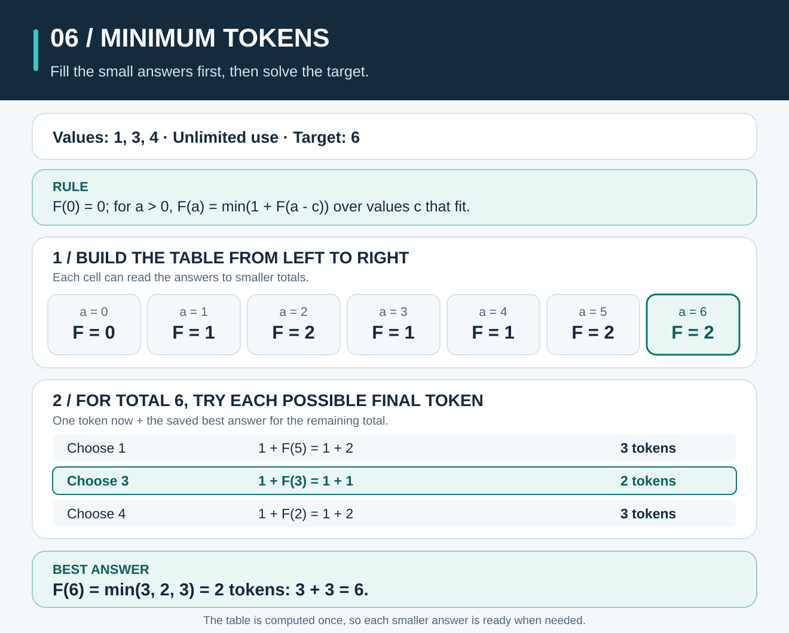
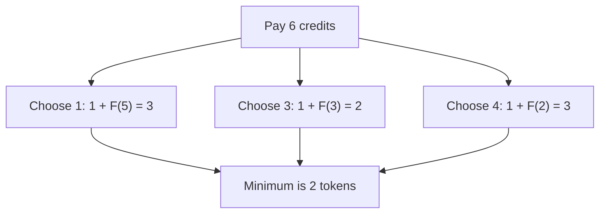
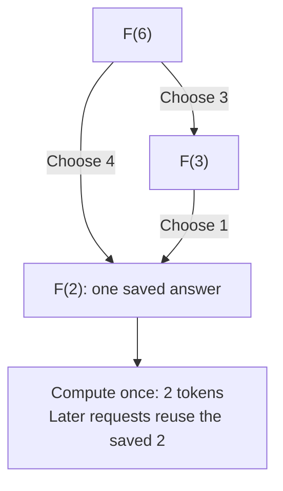

# Dynamic Programming: Reuse Answers to Smaller Questions



**The idea:** Dynamic programming (DP) solves a problem by answering smaller questions once and reusing those answers. It works here because the best way to finish a payment depends on the best way to pay the amount left over.

## Picture it in everyday life

An arcade accepts tokens worth **1, 3, or 4 credits** each. You need to pay **exactly 6 credits** using as few tokens as possible. You may use any value as many times as you like. A 4-credit token looks like the best first choice, but `4 + 1 + 1` takes **3 tokens**. Two 3-credit tokens pay the same amount with **2 tokens**: `3 + 3 = 6`.

This is a small counterexample to the rule “always take the largest token that fits.” That rule can work for some sets of values; it does not work for `[1, 3, 4]` at amount 6. We want the **minimum number of tokens**, not the number of different token values or the number of possible combinations.

## Break the question into smaller questions

Let `F(a)` be the minimum number of tokens needed to pay **exactly** `a` credits. `F(0) = 0`: paying nothing needs no tokens. For a positive amount, imagine choosing **one** token `c`. The rest must pay `a − c` credits. Choosing `c` costs one token, plus the best answer for the rest:

```text
F(0) = 0
F(a) = 1 + min(F(a − c))
       over token values c where c <= a and a − c can be paid exactly
F(a) = impossible if no such c exists
```

All token values must be positive. We ignore a choice when its remainder is impossible; `impossible` is **not** a large number to add to 1. For the Go functions in this chapter, an impossible amount is returned as `-1` with no error. A negative amount or a token value of zero or less is invalid and returns an error.

The order of tokens does not affect their sum. Trying every possible token for this step covers every payment; the recurrence keeps the smallest resulting count.



Notice that a smaller question can arise through different choices. For example, `F(2)` is needed while solving `F(3)` after choosing 1, and while solving `F(6)` after choosing 4. Recomputing it in every branch wastes work. DP stores `F(2)` after its first calculation.

## Work through the table

Start at zero and solve amounts in increasing order. Each `F(a − c)` is already known because `c` is positive, so `a − c < a`. Cross out token values larger than the current amount.

| Amount `a` | Try token 1 | Try token 3 | Try token 4 | Best `F(a)` | One best payment |
| ---: | --- | --- | --- | ---: | --- |
| 0 | — | — | — | **0** | No tokens |
| 1 | `1 + F(0) = 1` | Too large | Too large | **1** | `1` |
| 2 | `1 + F(1) = 2` | Too large | Too large | **2** | `1 + 1` |
| 3 | `1 + F(2) = 3` | `1 + F(0) = 1` | Too large | **1** | `3` |
| 4 | `1 + F(3) = 2` | `1 + F(1) = 2` | `1 + F(0) = 1` | **1** | `4` |
| 5 | `1 + F(4) = 2` | `1 + F(2) = 3` | `1 + F(1) = 2` | **2** | `4 + 1` |
| 6 | `1 + F(5) = 3` | `1 + F(3) = 2` | `1 + F(2) = 3` | **2** | `3 + 3` |

The completed row of answers is **`[0, 1, 2, 1, 1, 2, 2]`** for amounts 0 through 6. At amount 6, the middle choice wins: `1 + F(3) = 1 + 1 = 2` tokens. The table records **counts**; the “one best payment” column is there to explain the answer, not to promise that the Go functions return the chosen tokens.

## Two ways to reuse the answers

**Top-down memoization** begins with `F(6)`. It asks for smaller amounts as needed, saves each answer, and returns a saved answer if that amount appears again. The base case is `F(0) = 0`. Each recursive call subtracts a positive value, so it moves toward zero. Memoize impossible amounts too, or later calls may repeat the same failed search.



The arrows show two ways to **need** `F(2)`, not an order in which calls must run. After its first calculation, either later path reads the saved answer instead of calculating it again.

**Bottom-up tabulation** begins with `F(0) = 0`. It fills the row `F(1), F(2), …, F(6)`, using previously filled amounts. Both methods use the same recurrence and obtain the same minimum count. The difference is **when** each smaller question is answered: on demand with memoization, or in increasing amount order with tabulation.

```text
Memoization: ask F(6) -> solve needed smaller amounts -> reuse saved answers
Tabulation:  F(0) -> F(1) -> F(2) -> F(3) -> F(4) -> F(5) -> F(6)
```

Here is the shared calculation, written as a classroom recipe. In the top-down version, replace `table[a − c]` with a recursive request for `F(a − c)` and save the result for `a` before returning it:

```text
table[0] = 0
for a from 1 through target:
    table[a] = impossible
    for each token value c:
        if c <= a and table[a − c] is possible:
            candidate = 1 + table[a − c]
            if table[a] is impossible or candidate < table[a]:
                table[a] = candidate
return table[target]
```

**Why is the recurrence correct?** Any exact payment for amount `a > 0` contains some valid token `c`; the remaining tokens pay `a − c`. If that remainder could be paid with fewer than `F(a − c)` tokens, replacing it would make the original payment shorter, contradicting that it was optimal. Thus the best payment containing a chosen `c` uses exactly `1 + F(a − c)` tokens. Taking the minimum over every valid choice gives the best overall payment. The base case `F(0) = 0` is correct. Since all remainders are smaller than `a`, induction from zero proves every reachable table entry, and the same reasoning justifies the memoized answers.

## The classroom math

Let `A` be the target amount and `C` the number of token values. There are at most `A + 1` amount states, from 0 through `A`. For each state, we may inspect all `C` token values. Both implementations take **`O(A × C)` time** and **`O(A)` space**. Memoization also uses a recursion stack of at most `O(A)` depth because every call reduces a nonnegative integer amount by at least 1; tabulation uses no recursive stack.

The amount's **numeric value** matters. A target of one million may need about one million table entries even though writing “1000000” takes only seven digits. This is often called *pseudo-polynomial* time. The bounds describe an unlimited-token, minimum-count problem; other DP problems can have different states and costs.

**Try it yourself:** Keep token values `[1, 3, 4]`, but set the target to **7**. What are the candidates for the token you choose, and what is `F(7)`? Then try token values `[3, 4]` with target **2**. Can it be paid exactly?

<details>
<summary>Check your answer</summary>

For 7 credits, `1 + F(6) = 3`, `1 + F(4) = 2`, and `1 + F(3) = 2`. So **`F(7) = 2`**, for example `3 + 4`. With values `[3, 4]`, neither token fits into 2 credits, so an exact payment is **impossible**; the Go functions return `-1, nil`.

</details>

## When should you use it?

Use DP when a problem has **overlapping smaller questions** and the best whole answer can be built from best smaller answers. Here, many payment choices ask for the same remaining amount, and the recurrence lets us reuse its minimum count. Plain recursion follows the same branching choices but may solve the same amount repeatedly. A greedy largest-first choice is tempting and sometimes correct, but it needs a separate correctness argument for the particular token values.

**Try the Go code:** Read [the memoized and tabulated implementations](../dynamicprogramming/mincoins.go) and [the runnable example](../examples/dynamic-programming/main.go). From the repository root on **macOS, Linux, or Windows (PowerShell)**, run:

```sh
go run ./examples/dynamic-programming
```

```text
Token values: [1 3 4]
Target: 6
Memoization: 2 tokens
Tabulation: 2 tokens
```

Then run `go test ./...` and change the target to 7 to check your exercise answer.
