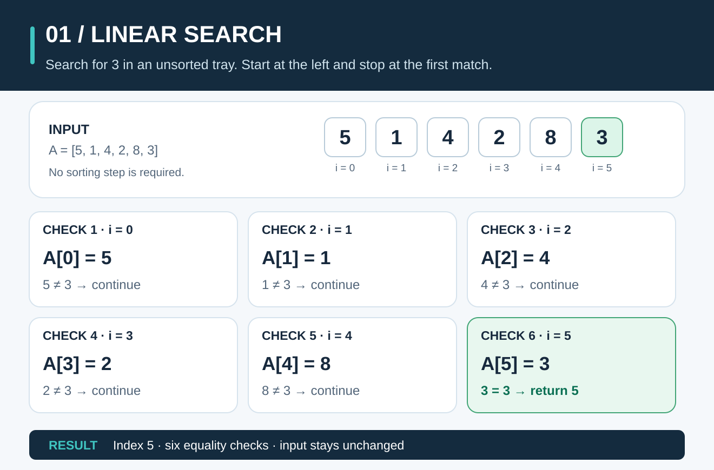
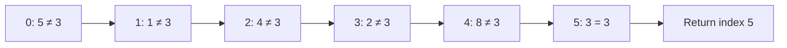

# Linear Search: Check One Item at a Time



**The idea:** Start at the first item. Check each item in order until you find what you want or run out of items.

## Picture it in everyday life

Imagine a lost-and-found tray with numbered tags lying in no particular order. You need tag **3**. Look at the first tag, then the next, and keep going until you see 3. A tag with a larger number gives no clue about where 3 is: the tray is **unsorted**.

Linear search works on an unsorted list. It also works on a sorted list, although a different method can use that order to skip items.

## Follow the tags

The tags are `A = [5, 1, 4, 2, 8, 3]`. We want `target = 3`. In Go, positions start at **0**, so the first tag is `A[0]` and the last is `A[5]`. At every step, ask only: **Is `A[i]` equal to 3?**

| Check | Index `i` | Value `A[i]` | `A[i] == 3`? | What happens next? |
| ---: | ---: | ---: | --- | --- |
| 1 | 0 | 5 | No | Check index 1. |
| 2 | 1 | 1 | No | Check index 2. |
| 3 | 2 | 4 | No | Check index 3. |
| 4 | 3 | 2 | No | Check index 4. |
| 5 | 4 | 8 | No | Check index 5. |
| 6 | 5 | 3 | Yes | Return **5**. |

**Result:** The value `3` is at index `5` (the sixth place). This example makes **6 equality checks**. The list stays exactly as it was.



If no tag matches, there is no index to return. The Go function returns **`-1`**, which cannot be a valid position in a slice.

## Work out the rule

Let `n` be the number of items. The possible indices are `0` through `n - 1`. Compare each item with the target, stopping at the **first** match:

```text
LINEAR_SEARCH(A, target):
    for i = 0 up to length(A) - 1:
        if A[i] == target:
            return i
    return -1
```

**Why is it correct?** Before checking index `i`, every earlier index `0` through `i - 1` has already been checked and does **not** hold the target. This is the *loop invariant*. If `A[i]` matches, no earlier match exists, so `i` is the first matching index. If the loop finishes, every item has failed the check, so `-1` is the right answer. This also explains what happens with duplicates: `LINEAR_SEARCH([7, 4, 7], 7)` returns `0`, not `2`.

## The classroom math

Count one `A[i] == target` comparison each time the loop visits an item. For a nonempty list:

| Case | Equality checks | Time |
| --- | ---: | --- |
| Target is first | `1` | `Θ(1)` |
| Target is at index `k` | `k + 1` | `Θ(k + 1)` |
| Target is last or absent | `n` | `Θ(n)` |

An empty list makes **0 equality checks** and returns `-1`. The average successful search needs `(n + 1)/2` checks **only when the target appears exactly once and its position is equally likely to be any of the `n` positions**:

```text
average = (1 + 2 + ... + n) / n
        = [n(n + 1) / 2] / n
        = (n + 1) / 2
```

For our six tags, that model gives `(6 + 1)/2 = 3.5` checks *on average across all six possible target positions*. Searching for `3` specifically took 6 checks. If the target is absent, it always takes `n` checks. The algorithm stores only the current index alongside the original slice: **`O(1)` extra space**. `Θ(1)` means a fixed amount of work; `Θ(n)` means the work grows with the list length.

**Try it yourself:** Search `[7, 4, 7, 2]` for `7`, then for `9`. What index and how many equality checks does each search return? **Check:** `7` matches at index `0` after **1** check. `9` is absent, so all **4** items are checked and the answer is `-1`.

## When should you use it?

Choose linear search when items are unsorted, you have a small list, or you need to look through the data just once. If the data is sorted and you need many lookups, read [Binary Search](binary-search.md): it can discard half of the remaining positions after each comparison.

For ordinary Go code, [`slices.Index`](https://pkg.go.dev/slices#Index) already returns the first matching index or `-1` if absent. The implementation here is for learning the steps.

**Try the Go code:** [searching/search.go](../searching/search.go). Change the target to a value that is missing and predict the result before running it.
