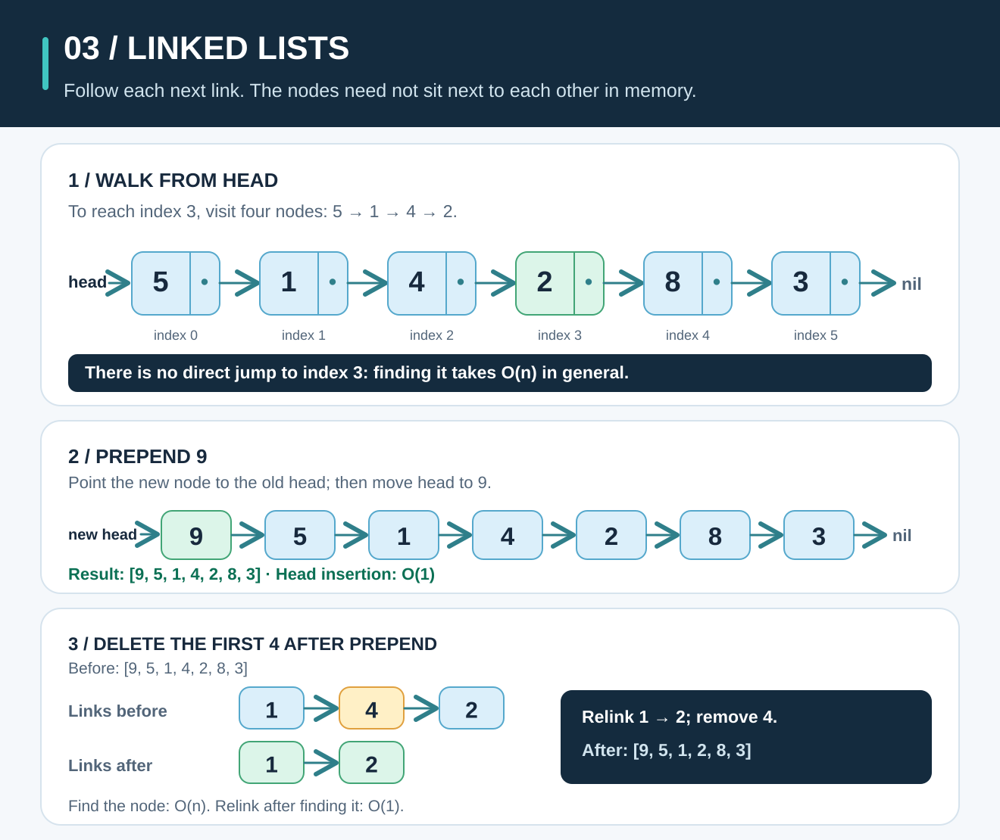
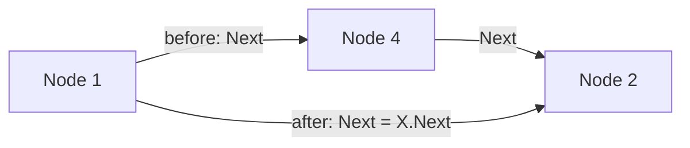

# Linked Lists: Follow the Clue to the Next Node



**The idea:** A linked list is a chain of *nodes*. Each node holds a value and a link to the next node. The first link is called `head`; the final node points to `nil`, meaning there is no next node.

## Picture it in everyday life

Imagine a treasure hunt. Each clue tells you where to find the next clue. To reach clue four, you start with clue one and follow three links. You cannot jump directly to clue four just because you know its number: the clues do not have to sit side by side.

Our **singly linked list** follows links in one direction:

```text
head → [5 | next] → [1 | next] → [4 | next] → [2 | next] → [8 | next] → [3 | nil]
index      0             1             2             3             4             5
```

The boxes show the *order of the links*, not memory addresses. Nodes need not be next to one another in memory. An empty list has `head = nil`.

## Follow the links

Suppose we want the value `2`. Start at `head` with index `0`. Each time the value is not `2`, follow `Next` and add one to the index.

| Visit | Index | Current value | Is it `2`? | Next step |
| ---: | ---: | ---: | --- | --- |
| 1 | 0 | 5 | No | Follow `Next` to 1. |
| 2 | 1 | 1 | No | Follow `Next` to 4. |
| 3 | 2 | 4 | No | Follow `Next` to 2. |
| 4 | 3 | 2 | Yes | Return index **3**. |

**Result:** `IndexOf(head, 2)` returns `3` after visiting four nodes and making four value checks. Position `3` is the fourth node because indexing starts at zero. If we reach `nil` first, the result is `-1`. If values repeat, we return the **first** matching index.

Now add `9` at the front. Make a new node whose `Next` points to the old head, then let `head` point to the new node:

```text
Before: head → 5 → 1 → 4 → 2 → 8 → 3 → nil
New link: 9.Next → old head (the node holding 5)
New head: head → 9
After:  head → 9 → 5 → 1 → 4 → 2 → 8 → 3 → nil
```

Only the new node and `head` change; the six existing nodes stay linked in their original order. **`Prepend` returns the new head**, so Go callers must assign it: `head = linkedlist.Prepend(head, 9)`.

Next, delete the **first** `4`. Starting at the new head, find the node *before* it (`1`). Change that node's `Next` from the `4` node to the `2` node:

```text
Before: head → 9 → 5 → 1 → 4 → 2 → 8 → 3 → nil
Change: node(1).Next = node(4).Next = node(2)
After:  head → 9 → 5 → 1 → 2 → 8 → 3 → nil
```

The remaining nodes are not copied or shifted. The list can no longer reach the removed `4` through `head`. If the first node itself matches, there is no predecessor: return `head.Next` as the new head. If the value is absent, return the original head. **Assign the return value** here too: `head = linkedlist.DeleteFirst(head, 4)`.



## Work out the rules

These steps match the [runnable Go implementation](../linkedlist/list.go). `Node(value, next)` means a node with `Value = value` and `Next = next`. Following `Next` is the only way these functions move through the list.

```text
INDEX_OF(head, target):
    index = 0
    for node = head; node != nil; node = node.Next:
        if node.Value == target: return index
        index = index + 1
    return -1

PREPEND(head, value):
    return Node(value, head)

APPEND(head, value):
    if head == nil: return Node(value, nil)
    node = head
    while node.Next != nil: node = node.Next
    node.Next = Node(value, nil)
    return head

DELETE_FIRST(head, target):
    if head == nil: return nil
    if head.Value == target: return head.Next
    previous = head
    while previous.Next != nil:
        if previous.Next.Value == target:
            previous.Next = previous.Next.Next
            return head
        previous = previous.Next
    return head
```

**Why does searching work?** Before examining the node at index `i`, the first `i` nodes have already failed the comparison. That is the loop invariant. If the current node matches, it is the first match. If the walk reaches `nil`, every node has been checked and `-1` is correct.

**Why does deletion work?** For a non-head match, `previous.Next` is the first matching node. Redirecting `previous.Next` to that node's `Next` skips exactly one node while keeping the rest of the chain reachable and in the same order. The head case updates the first link instead. This is why deleting a matching value twice can remove two different nodes when duplicates exist.

## The classroom math

Let `n` be the number of nodes. Let `k` be a zero-based position. Reaching position `k` requires following `k` `Next` links from `head`, so finding and checking that node takes `Θ(k + 1)` work. There is **no constant-time `list[k]` shortcut** in this representation.

| Operation | Work | Why? |
| --- | --- | --- |
| Read the first node | `Θ(1)` | `head` already points to it. |
| `Prepend` | `Θ(1)` | Create one node and change the head link. |
| `IndexOf` | `Θ(1)` if the first node matches; `Θ(n)` if last or absent | Visit nodes until a match or `nil`. |
| `Append` **without a tail link** | `Θ(n)` for a nonempty list | Walk to the last node before linking the new one. An empty list takes `Θ(1)`. |
| `DeleteFirst` | `Θ(1)` if the head matches; `Θ(n)` if last or absent | Find the first matching node, then change one link. |

If you **already have a reference to the predecessor**, relinking around its successor is `Θ(1)`. Finding that predecessor from `head` still takes up to `Θ(n)`; the whole `DeleteFirst` operation is therefore **not** constant time in general. A list of `n` nodes uses `Θ(n)` space for its values **and** `Next` links, with one node allocation per inserted value in this Go example.

For our search for `2`, `k = 3`: follow **three** links, visit **four** nodes, and make **four** value checks. If `2` is absent, all six nodes are visited, giving `Θ(n)` time.

**Try it yourself:** Starting at `5 → 1 → 4 → 2 → 8 → 3`, prepend `9`, delete the first `4`, then search for `2`. What is the final chain and index? What happens if you then delete `9`?

<details>
<summary>Check your answer</summary>

After the first two changes, the chain is `9 → 5 → 1 → 2 → 8 → 3 → nil`. The `2` is at index **3**, after four node visits. Deleting `9` removes the head, so the returned head points to `5`: `5 → 1 → 2 → 8 → 3 → nil`.

</details>

## When should you use it?

Compare the list with a Go **slice**, whose backing array holds values in consecutive positions:

| Need | Go slice | Singly linked list here |
| --- | --- | --- |
| Read position `k` | `Θ(1)` with `slice[k]` | `Θ(k + 1)` from `head` |
| Add at the front | `Θ(n)` to make room and shift/copy values | `Θ(1)` with `Prepend` |
| Add at the end | Amortized `Θ(1)` with `append`; an individual growth can copy `Θ(n)` values | `Θ(n)` without a tail link |
| Delete a known node after a known predecessor | Values after it must move: up to `Θ(n)` | Change one link: `Θ(1)` |

A linked list is useful to **learn pointer links** and when your work often changes the front or reconnects nodes you already have references to. A Go slice is usually simpler when you need indexed reads and compact storage. Neither structure makes searching an unsorted sequence faster than a scan just by existing.

Go also provides [`container/list`](https://pkg.go.dev/container/list), but it is a **doubly** linked list: its elements have both next and previous links. This guide intentionally builds a smaller singly linked list so you can see every link change.

**Run the example:** From the repo root on macOS, Linux, or Windows (PowerShell), run `go run ./examples/data-structures`. Read the [runnable example](../examples/data-structures/main.go) and [linked-list implementation](../linkedlist/list.go), then check them with `go test ./...`.
