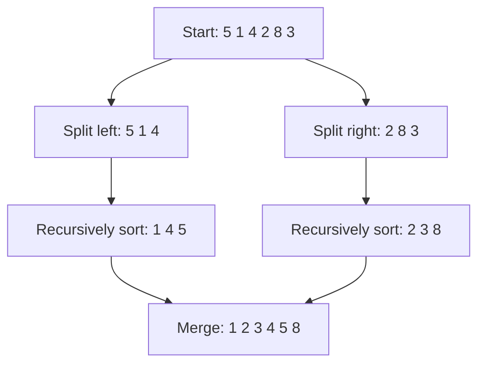

# Merge Sort: Split the List, Then Rebuild It in Order


**The idea:** Split a list into smaller parts until each part has one item. Then merge sorted parts by repeatedly taking the smaller item at the front.

## Picture it in everyday life

Imagine sorting a stack of receipts by total. First, split the stack into one-receipt piles. Then combine two piles at a time. If each pile is already ordered from smallest total to largest, you only need to compare the first receipt in each pile and take the smaller one. Repeat until both piles are empty.

Merge sort uses that trick on the whole unsorted stack. One-item piles are already sorted; merging them builds larger sorted piles. **Simply joining two unsorted halves would not work.**

## Follow the numbers

Start with `[5, 1, 4, 2, 8, 3]`. For a group of `n` items, cut after `⌊n/2⌋` items (`⌊ ⌋` means round down). Here `n = 6`, so the first cut is after the first three items:

```text
                  [5, 1, 4, 2, 8, 3]
                  /                \
           [5, 1, 4]           [2, 8, 3]
           /      \             /      \
         [5]     [1, 4]       [2]     [8, 3]
                  /   \                 /   \
                [1]   [4]             [8]   [3]
```

Now work **from the bottom up**. Merge `[1]` with `[4]` to get `[1, 4]`. For `[5]` and `[1, 4]`, compare `5` with `1`, then `5` with `4`: take `1`, take `4`, then append `5` to get `[1, 4, 5]`. On the right, merge `[8]` with `[3]` to get `[3, 8]`; compare `2` with `3`, take `2`, then append `3, 8` to get `[2, 3, 8]`.

For the last merge, each half is already sorted. Compare only their **front** values. `buffer[k]` is the next empty place in the temporary result; positions start at `0`.

| Step | Compare the fronts | Write | Buffer after the write |
| --- | --- | --- | --- |
| 1 | `1` vs `2` | `buffer[0] = 1` | `[1]` |
| 2 | `4` vs `2` | `buffer[1] = 2` | `[1, 2]` |
| 3 | `4` vs `3` | `buffer[2] = 3` | `[1, 2, 3]` |
| 4 | `4` vs `8` | `buffer[3] = 4` | `[1, 2, 3, 4]` |
| 5 | `5` vs `8` | `buffer[4] = 5` | `[1, 2, 3, 4, 5]` |
| 6 | Left half is empty | `buffer[5] = 8` | `[1, 2, 3, 4, 5, 8]` |

That is **5 value comparisons and 6 buffer writes** for this last merge. The code then makes **6 more writes** to copy those values back into the original slice, giving `[1, 2, 3, 4, 5, 8]`. These counts describe the last merge only, not all earlier merges.

Across **all five merges** in this example, the `<=` test makes `1 + 2 + 1 + 1 + 5 = 10` value comparisons. The merges make `2 + 3 + 2 + 3 + 6 = 16` buffer writes and copy back the same 16 values. Loop checks and recursive calls are not included in these example counts.

**Try it yourself:** Merge `[1, 4]` with `[2, 3]`. Which values do you compare, in order? **Check:** `1` vs `2`, `4` vs `2`, then `4` vs `3`. Take `1, 2, 3`, append `4`, and get `[1, 2, 3, 4]` after three value comparisons.



**Why does this work?** A one-item list is already sorted. If two smaller lists are sorted, taking the smaller front item each time produces a sorted combined list. Repeating that step builds a sorted result from the bottom up.

## The classroom math

The Go implementation follows this procedure. `n` is the length of the current group; `A[0:m]` means its first `m` items and `A[m:n]` means the rest. `B` is one temporary array, reused during the recursive calls. The indices `i`, `j`, and `k` point to the next unused item on the left, the next unused item on the right, and the next empty buffer position.

```text
MERGE_SORT(A):
    if length(A) < 2: return
    B = new array of length(A)
    SORT(A, B)

SORT(A, B):
    n = length(A)
    if n < 2: return
    m = floor(n / 2)
    SORT(A[0:m], B[0:m])
    SORT(A[m:n], B[m:n])

    i = 0; j = m; k = 0
    while i < m and j < n:
        if A[i] <= A[j]:
            B[k] = A[i]; i = i + 1
        else:
            B[k] = A[j]; j = j + 1
        k = k + 1
    while i < m:
        B[k] = A[i]; i = i + 1; k = k + 1
    while j < n:
        B[k] = A[j]; j = j + 1; k = k + 1
    copy B[0:n] back to A
```

**Why is the merge correct?** Before writing position `k`, the first `k` positions of `B` contain the `k` smallest values from the two halves, in order. Because each half is sorted, its front is its smallest unused value. Taking the smaller front keeps the statement true for position `k + 1`. When a half runs out, the other half is already sorted, so its remaining values can be copied as they are. The one-item base case and this merge rule together prove that every recursive call returns a sorted group. Choosing the left value when the fronts are equal (`<=`) also preserves the original order of equal values.

**How much work?** Let `T(n)` be the work to sort `n` items. `Θ(f(n))` means the work grows proportionally to `f(n)` as `n` grows, ignoring constant factors. Two recursive calls handle groups of sizes `⌊n/2⌋` and `⌈n/2⌉`; the merge writes and copies all `n` items, taking `Θ(n)` work:

```text
T(n) = T(⌊n/2⌋) + T(⌈n/2⌉) + Θ(n),  for n > 1
T(0) = T(1) = Θ(1)
```

Each split roughly halves the group, so there are about `log₂ n` levels (`log₂ n` asks how many halvings reach one item). A full level merges `n` items altogether; when `n` is not a power of two, the lowest level may contain fewer merges. Each item still travels through roughly `log₂ n` merges, so the total is `Θ(n log n)` in the best, average, and worst cases. The reusable buffer holds `n` values, or `O(n)` extra space; the recursion stack adds `O(log n)`, so total extra space remains `O(n)`.

## When should you use it?

Merge sort is a good model when you need predictable `O(n log n)` work and the original order of equal items matters. For example, if two receipts have the same total, a stable sort keeps them in their original order. The trade-off for the array version here is extra memory for merging.

| Property | This implementation |
| --- | --- |
| Time | `O(n log n)` in the best, average, and worst cases |
| Extra space | `O(n)` for merged values, plus recursion bookkeeping |
| Stable? | Yes, **if** a tie takes the item from the left half first. Equal items then stay in their original relative order. |

For production Go code, [`slices.SortStableFunc`](https://pkg.go.dev/slices#SortStableFunc) is the usual choice when equal items must keep their order. Use [`slices.Sort`](https://pkg.go.dev/slices#Sort) for plain numbers when stability does not matter.

**Try the Go code:** [sorting/sort.go](../sorting/sort.go). Look for the comparison made while merging two halves.
