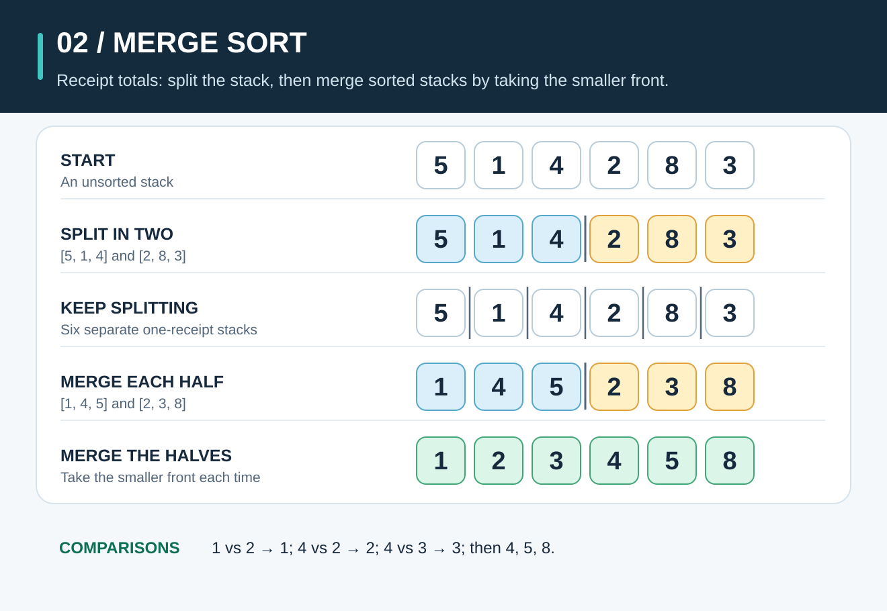
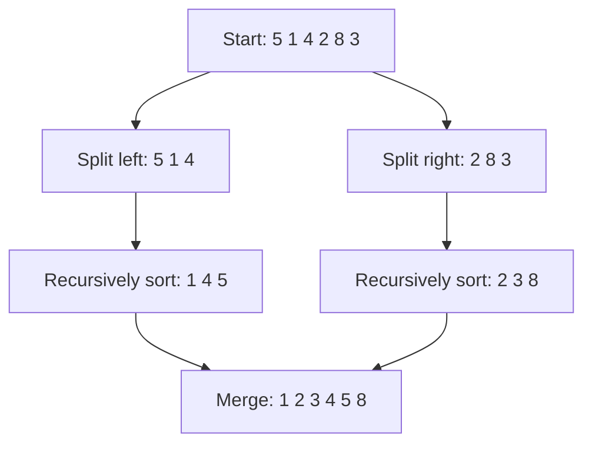

# Merge Sort: Split the List, Then Rebuild It in Order

**The idea:** Split a list into smaller parts until each part has one item. Then merge sorted parts by repeatedly taking the smaller item at the front.

## Picture it in everyday life

Imagine sorting a stack of receipts by total. First, split the stack into one-receipt piles. Then combine two piles at a time. If each pile is already ordered from smallest total to largest, you only need to compare the first receipt in each pile and take the smaller one. Repeat until both piles are empty.

Merge sort uses that trick on the whole unsorted stack. One-item piles are already sorted; merging them builds larger sorted piles. **Simply joining two unsorted halves would not work.**

## Follow the numbers

Start with `[5, 1, 4, 2, 8, 3]`.

1. Split it into `[5, 1, 4]` and `[2, 8, 3]`.
2. Keep splitting. For example, `[5, 1, 4]` becomes `[5]` and `[1, 4]`, then `[1, 4]` becomes `[1]` and `[4]`.
3. Merge upward: `[1]` and `[4]` become `[1, 4]`; merge that with `[5]` to get `[1, 4, 5]`.
4. Do the same on the right: `[8]` and `[3]` become `[3, 8]`; merge that with `[2]` to get `[2, 3, 8]`.
5. Merge the two sorted halves. Take the smaller front value each time, producing `1`, `2`, `3`, `4`, `5`, `8`. The result is `[1, 2, 3, 4, 5, 8]`.

**Why does this work?** A one-item list is already sorted. If two smaller lists are sorted, taking the smaller front item each time produces a sorted combined list. Repeating that step builds a sorted result from the bottom up.

## When should you use it?

Merge sort is a good model when you need predictable `O(n log n)` work and the original order of equal items matters. For example, if two receipts have the same total, a stable sort keeps them in their original order. The trade-off for the array version here is extra memory for merging.

| Property | This implementation |
| --- | --- |
| Time | `O(n log n)` in the best, average, and worst cases |
| Extra space | `O(n)` for merged values, plus recursion bookkeeping |
| Stable? | Yes, **if** a tie takes the item from the left half first. Equal items then stay in their original relative order. |

For production Go code, [`slices.SortStableFunc`](https://pkg.go.dev/slices#SortStableFunc) is the usual choice when equal items must keep their order. Use [`slices.Sort`](https://pkg.go.dev/slices#Sort) for plain numbers when stability does not matter.

**Try the Go code:** [sorting/sort.go](../sorting/sort.go). Look for the comparison made while merging two halves.
