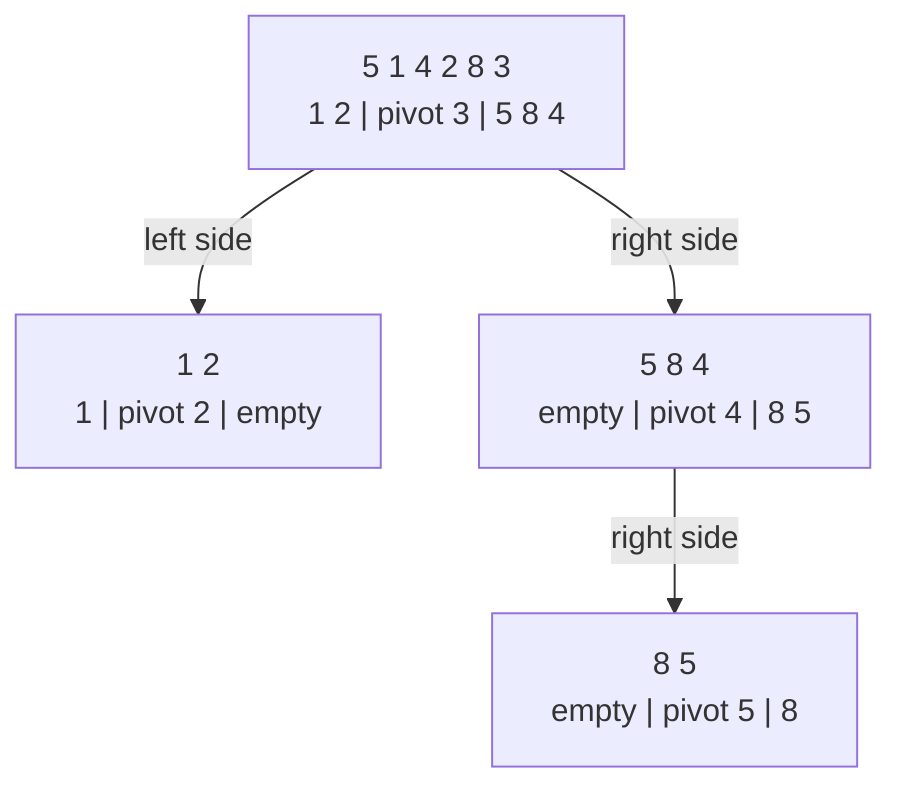

# Quick Sort: Pick a Pivot and Sort Each Side


**The idea:** Pick one value, called the *pivot*. Move smaller values to its left and values at least as large to its right. Then sort the two sides the same way.

## Picture it in everyday life

Imagine a row of numbered pickup tickets at a café. Pick the last ticket as a reference. Put tickets with lower numbers on one side and the others on the other side. Now do the same inside each side. Once every group is small enough, the whole row is in order.

The important catch: after the first split, **the tickets on each side are not necessarily sorted yet**. You must repeat the process.

## Follow the numbers

We sort `[5, 1, 4, 2, 8, 3]`. The code chooses the **last value, `3`, as the pivot**. Imagine a marker called `nextSmall`: it points to the next position reserved for a value smaller than `3`. Positions start at **0**, as they do in Go.

| Position checked (`i`) | Compare with `3` | Action | Row afterward | `nextSmall` afterward |
| --- | --- | --- | --- | ---: |
| Start | — | Set `nextSmall = 0`. | `[5, 1, 4, 2, 8, 3]` | 0 |
| 0: `5` | `5 < 3` is false | Leave `5` for the right side. | `[5, 1, 4, 2, 8, 3]` | 0 |
| 1: `1` | `1 < 3` is true | Swap positions 1 and 0. | `[1, 5, 4, 2, 8, 3]` | 1 |
| 2: `4` | `4 < 3` is false | Leave `4` for the right side. | `[1, 5, 4, 2, 8, 3]` | 1 |
| 3: `2` | `2 < 3` is true | Swap positions 3 and 1. | `[1, 2, 4, 5, 8, 3]` | 2 |
| 4: `8` | `8 < 3` is false | Leave `8` for the right side. | `[1, 2, 4, 5, 8, 3]` | 2 |

Now swap the pivot at position 5 with the value at `nextSmall = 2`. The **first partition** ends at `[1, 2, 3, 5, 8, 4]`: every value in `[1, 2]` is smaller than `3`, and every value in `[5, 8, 4]` is at least `3`. The pivot is in its final position, but the right side is **not sorted yet**.

Next, sort each side by the same rule:

| Side to sort | Last-value pivot | After partitioning that side |
| --- | ---: | --- |
| `[1, 2]` | 2 | Left `[1]`, pivot `2`, right `[]` |
| `[5, 8, 4]` | 4 | Left `[]`, pivot `4`, right `[8, 5]` |
| `[8, 5]` | 5 | Left `[]`, pivot `5`, right `[8]` |

The one-value and empty sides need no work. Reading the final positions from left to right gives **`[1, 2, 3, 4, 5, 8]`**. This run makes **9 value-to-pivot comparisons**: `5 + 1 + 2 + 1` across the four partitions. That counts comparisons, not swaps; the Go code can even swap a value with itself.

Here is the procedure behind those rows. Call `QUICK_SORT(A, 0, n - 1)` to sort the whole row:

```text
QUICK_SORT(A, low, high):
    if low >= high: return
    pivot = A[high]
    nextSmall = low
    for i = low up to high - 1:
        if A[i] < pivot:
            swap A[nextSmall] and A[i]
            nextSmall = nextSmall + 1
    swap A[nextSmall] and A[high]
    QUICK_SORT(A, low, nextSmall - 1)
    QUICK_SORT(A, nextSmall + 1, high)
```



## Why the partition is correct

At any point while scanning position `i`, the row has three regions before the pivot:

```text
positions low ... nextSmall-1    contain values < pivot
positions nextSmall ... i-1      contain values >= pivot
positions i ... high-1           have not been checked yet
position high                    holds the pivot
```

If the next value is small, swapping it into `nextSmall` grows the first region. Otherwise, the second region grows. When the scan ends, placing the pivot at `nextSmall` puts it between all smaller values and all values at least as large. No later step needs to move a value across that pivot. Sorting the two smaller sides by the same reasoning finishes the whole row; a side with zero or one value is already sorted.

## How much work does it take?

Let `n` be the number of values in a side and `k` the number smaller than its pivot. A partition checks each of the other `n - 1` values **once**, regardless of how many swaps happen. If `C(n)` counts only value-to-pivot comparisons, then:

```text
C(0) = C(1) = 0
C(n) = C(k) + C(n - k - 1) + (n - 1), for n >= 2
```

- **Balanced splits (best case):** `k` stays near `(n - 1) / 2`. There are about `log2(n)` levels, with about `n` comparisons across each level, so the total grows as `O(n log n)`.
- **Very uneven splits (worst case):** `k` is always `0` or `n - 1`. Then `C(n) = C(n - 1) + (n - 1) = 1 + 2 + ... + (n - 1) = n(n - 1)/2`, which grows as `O(n²)`. With this last-value pivot, an already sorted row causes such splits; an all-equal row does too because the test is strictly `< pivot`.
- **Average case:** For a random ordering of **distinct** values, the pivot's rank can fall anywhere, so the average includes both balanced and uneven splits. Its expected comparison count grows as `O(n log n)`; this is an average over many orders, not a guarantee for one row.

If you know probability, `E[C(n)]` means the average comparison count over those random orders. Each possible pivot rank is equally likely, giving:

```text
E[C(n)] = (n - 1) + (1/n) * sum over k = 0 ... n-1 of
          (E[C(k)] + E[C(n - k - 1)])
```

Solving this recurrence gives `E[C(n)] = 2(n + 1)H_n - 4n`, where `H_n = 1 + 1/2 + ... + 1/n` grows roughly like `log n`.

The recursive calls also take space on the call stack: `O(log n)` levels for balanced splits, and `O(n)` levels if each partition leaves a side of size `n - 1`.

**Try it yourself:** Starting from `[1, 2, 3, 5, 8, 4]`, partition the right side `[5, 8, 4]` around its last value. Where does `4` land, and what still needs sorting?

<details>
<summary>Check your answer</summary>

The row becomes `[1, 2, 3, 4, 8, 5]`. The pivot `4` is in its final position; `[8, 5]` still needs sorting.

</details>

## When should you use it?

Quick sort is useful for learning how *partitioning* can turn one large task into two smaller ones. Its partition step rearranges the original slice. This version can be slow on sorted or equal-heavy input, and it does not preserve the original order of equal items.

| Property | This implementation |
| --- | --- |
| Time | Best and average `O(n log n)`; worst `O(n²)` when pivots repeatedly make uneven splits |
| Extra space | No second data slice for partitioning, but recursion uses `O(log n)` stack space on average and `O(n)` in the worst case |
| Stable? | No. Swaps can change the order of items with equal keys. |

For ordinary Go code, use [`slices.Sort`](https://pkg.go.dev/slices#Sort) or [`slices.SortFunc`](https://pkg.go.dev/slices#SortFunc). If equal items must keep their relative order, use [`slices.SortStableFunc`](https://pkg.go.dev/slices#SortStableFunc). Those are practical defaults; this version is here so you can see the pivot method clearly.

**Try the Go code:** [sorting/sort.go](../sorting/sort.go). Try an already sorted input and watch where the last-element pivot lands each time.
