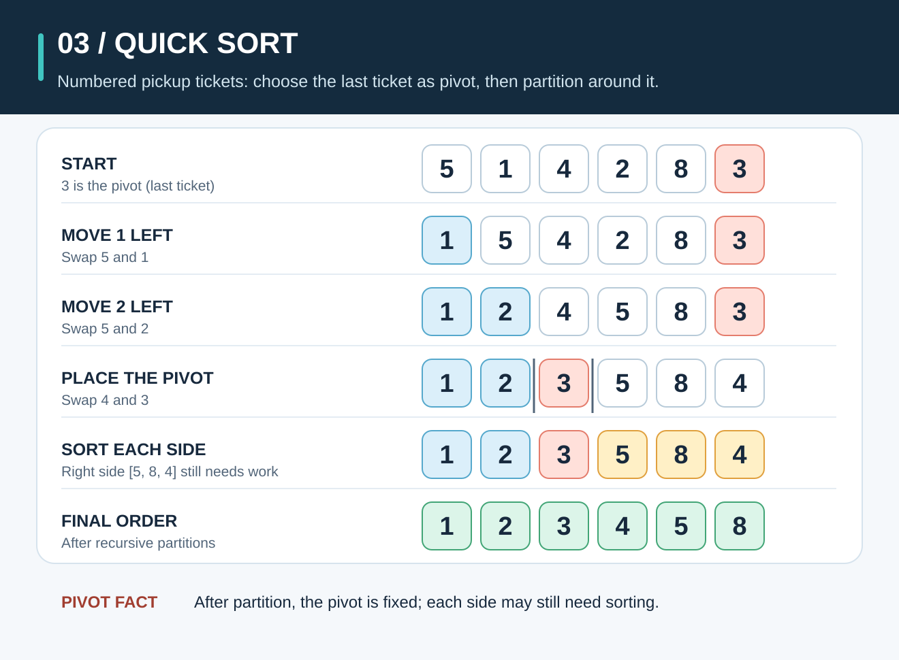
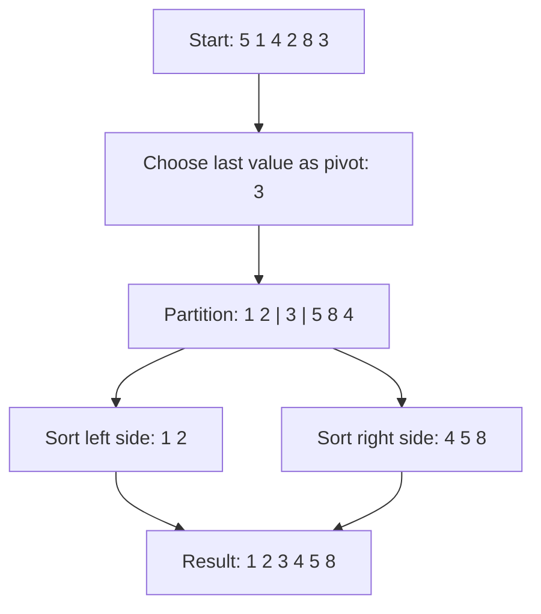

# Quick Sort: Pick a Pivot and Sort Each Side

**The idea:** Pick one value, called the *pivot*. Move smaller values to its left and values at least as large to its right. Then sort the two sides the same way.

## Picture it in everyday life

Imagine a row of numbered pickup tickets at a café. Pick the last ticket as a reference. Put tickets with lower numbers on one side and the others on the other side. Now do the same inside each side. Once every group is small enough, the whole row is in order.

The important catch: after the first split, **the tickets on each side are not necessarily sorted yet**. You must repeat the process.

## Follow the numbers

We sort `[5, 1, 4, 2, 8, 3]` with the **last value, `3`, as the first pivot**. This example uses a partition that swaps values inside the original row.

1. Scan `5, 1, 4, 2, 8`. Move values smaller than `3` toward the left. Here, those are `1` and `2`.
2. Place the pivot between the two sides. The row becomes **`[1, 2, 3, 5, 8, 4]`**.
3. The pivot `3` is now in its final place. The left side `[1, 2]` is sorted, but the right side `[5, 8, 4]` is not.
4. Sort each side recursively. The final result is `[1, 2, 3, 4, 5, 8]`.

**Why does this work?** Once the pivot is placed, no value on the left needs to cross to the right, and no value on the right needs to cross to the left. Sorting both sides completes the job.

## When should you use it?

Quick sort is useful for learning how *partitioning* can turn one large task into two smaller ones. Its typical running time is good and its partition step rearranges the original slice. But with this last-element pivot rule, an already sorted input produces very uneven splits and `O(n²)` work. It also does not preserve the original order of equal items.

| Property | This implementation |
| --- | --- |
| Time | Best and average `O(n log n)`; worst `O(n²)` when pivots repeatedly make uneven splits |
| Extra space | No second data slice for partitioning, but recursion uses `O(log n)` stack space on average and `O(n)` in the worst case |
| Stable? | No. Swaps can change the order of items with equal keys. |

For ordinary Go code, use [`slices.Sort`](https://pkg.go.dev/slices#Sort) or [`slices.SortFunc`](https://pkg.go.dev/slices#SortFunc). If equal items must keep their relative order, use [`slices.SortStableFunc`](https://pkg.go.dev/slices#SortStableFunc). Those are practical defaults; this version is here so you can see the pivot method clearly.

**Try the Go code:** [sorting/sort.go](../sorting/sort.go). Try an already sorted input and watch where the last-element pivot lands each time.
