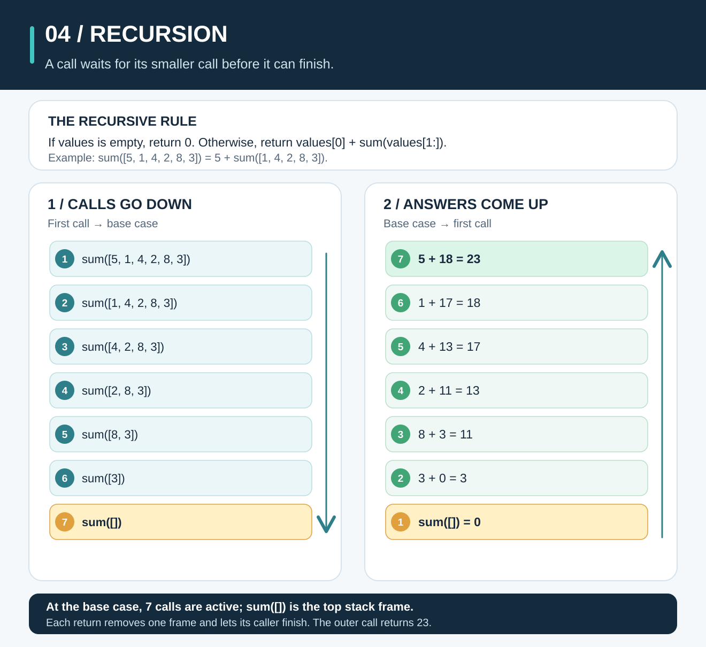
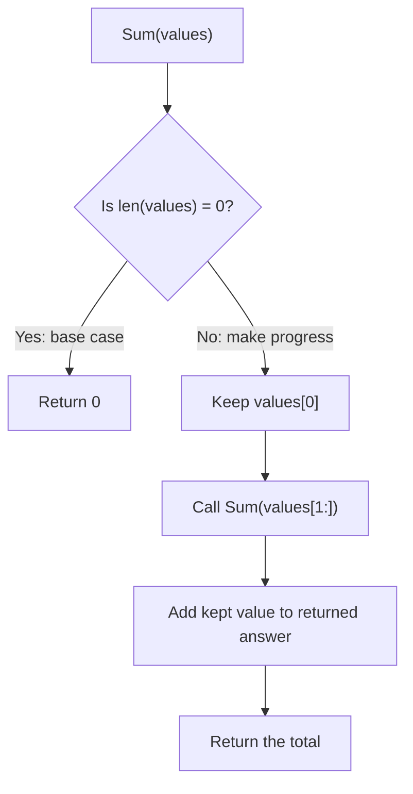

# Recursion: Solve One Piece, Then Ask Again



**The idea:** A recursive function calls itself with a **smaller version of the same problem**. It must have a **base case** that answers without another call. Once that case returns, the waiting calls finish in reverse order.

## Picture it in everyday life

Imagine a stack of receipts with amounts `5, 1, 4, 2, 8, 3`. You take the first receipt, `5`, and ask a helper to total the remaining five. That helper keeps `1` and asks another helper to total the remaining four. The question gets smaller until a helper receives **no receipts** and answers `0`.

Then the answers travel back: `3 + 0 = 3`, `8 + 3 = 11`, and so on until you can answer `5 + 18 = 23`. Each helper waits for the next answer before adding the amount it kept. A computer tracks those waiting calls on its **call stack**.

This is the same row used in Chapters 1–3: `values = [5, 1, 4, 2, 8, 3]`. We want its **sum**, not its sorted order or an index.

## Follow every call and return

On the way **down**, `Sum` keeps the first value and calls itself with everything after it. `depth` counts how many calls are already waiting; depth `0` is the first call.

| Depth | Call being made | First value waiting to be added |
| ---: | --- | ---: |
| 0 | `Sum([5, 1, 4, 2, 8, 3])` | 5 |
| 1 | `Sum([1, 4, 2, 8, 3])` | 1 |
| 2 | `Sum([4, 2, 8, 3])` | 4 |
| 3 | `Sum([2, 8, 3])` | 2 |
| 4 | `Sum([8, 3])` | 8 |
| 5 | `Sum([3])` | 3 |
| 6 | `Sum([])` | No first value; return `0`. |

That last row is the **base case**. It stops the calls. On the way **up**, each waiting call adds its saved first value to the answer it just received:

| Returning from | Calculation | Answer returned |
| --- | --- | ---: |
| `Sum([])` | Base case | 0 |
| `Sum([3])` | `3 + 0` | 3 |
| `Sum([8, 3])` | `8 + 3` | 11 |
| `Sum([2, 8, 3])` | `2 + 11` | 13 |
| `Sum([4, 2, 8, 3])` | `4 + 13` | 17 |
| `Sum([1, 4, 2, 8, 3])` | `1 + 17` | 18 |
| `Sum([5, 1, 4, 2, 8, 3])` | `5 + 18` | **23** |

The call direction is **six values → no values**. The return direction is **0 → 3 → 11 → 13 → 17 → 18 → 23**. Do not add `5` before the smaller call returns: at that point its answer is not known yet.



## Work out the rule

Let `S(values)` mean the sum of a list. `first` is its first value; `rest` contains every value after it:

```text
S([]) = 0
S([first, rest...]) = first + S([rest...])
```

The notation `rest...` describes the remaining values; it is not Go syntax. In Go, the smaller slice is `values[1:]`:

```text
SUM(values):
    if length(values) == 0:
        return 0
    return values[0] + SUM(values[1:])
```

Both parts matter. **Base case:** an empty list has sum `0`, the *additive identity* (`x + 0 = x`), so no further call is needed. **Progress:** a nonempty list loses exactly one value in the next call. Starting with `n` values, the lengths are `n, n−1, …, 1, 0`, so the base case is reached after `n` reductions. A self-call on the *same* list would not make progress.

For our six values, the nested calculation is:

```text
S([5, 1, 4, 2, 8, 3])
  = 5 + (1 + (4 + (2 + (8 + (3 + 0)))))
  = 5 + 18
  = 23
```

**Why is it correct?** Prove it by the number `n` of values. For `n = 0`, the function returns `0`, the correct sum of an empty list. Suppose it returns the correct sum for any list of `n−1` values. A list of `n` values has a first value and a rest of `n−1` values. The recursive call correctly sums the rest by our assumption; adding the first value gives the sum of the whole list. This also explains why the first value must be added **after** the smaller answer comes back.

## The classroom math

Let `T(n)` be the time for a list of `n` values. Each nonempty call does a fixed amount of work besides its one smaller call:

```text
T(0) = Θ(1)
T(n) = T(n−1) + Θ(1), for n > 0
     = Θ(1) + n × Θ(1)
     = Θ(n)
```

There are **`n` additions and `n + 1` calls**, including `Sum([])`: six additions and seven calls when `n = 6`. Each waiting call keeps a small amount of information, so this implementation uses **`Θ(n)` extra call-stack space** for nonempty input of growing size. Slicing with `values[1:]` creates a new slice view of the same underlying array; it does **not** copy the remaining elements at every call. See the [Go specification on slice expressions](https://go.dev/ref/spec#Slice_expressions) and the [Go slices guide](https://go.dev/blog/slices-intro). The linear stack cost comes from the waiting calls, not from repeatedly copying the list. An empty input takes `Θ(1)` time and stack space.

| Number of values | Calls | Additions | Maximum active calls |
| ---: | ---: | ---: | ---: |
| 0 | 1 | 0 | 1 |
| 6 | 7 | 6 | 7 |
| `n` | `n + 1` | `n` | `n + 1` |

These bounds describe **this sum function**, not every recursive algorithm. For example, [Merge Sort](merge-sort.md) makes two smaller calls at each split and has a different recurrence.

**Try it yourself:** Apply the same rule to `[5, 1, 4]`. Write the calls in order, then write each returned value. What does `Sum([])` return?

<details>
<summary>Check your answer</summary>

Calls: `Sum([5, 1, 4]) → Sum([1, 4]) → Sum([4]) → Sum([])`. Returns: `0 → 4 → 5 → 10`. The empty list returns `0`, so the full result is **10**.

</details>

## When should you use it?

Recursion is useful when the problem naturally contains **smaller problems of the same shape**, such as traversing a nested tree or splitting and merging lists. Before writing a recursive call, identify its base case, show that the input gets smaller, and decide what happens when the smaller answer returns. [Merge Sort](merge-sort.md) is a divide-and-conquer example. [Binary Search](binary-search.md) can be expressed recursively too, though this repo's Go implementation uses a loop.

For a plain sum, a loop is usually simpler and uses `O(1)` extra space. This recursive version is for learning the call-and-return pattern. Go grows goroutine stacks, but sufficiently deep recursion can exceed the [stack limit](https://pkg.go.dev/runtime/debug#SetMaxStack); a loop fits very long linear inputs better. As with any `int` sum, the result must fit in Go's `int` type if you need the exact mathematical total.

**Try the Go code:** Read [the `Sum` implementation](../recursion/sum.go) and [runnable example](../examples/recursion/main.go). From the repo root on **macOS, Linux, or Windows (PowerShell)**, run:

```sh
go run ./examples/recursion
```

```text
Values: [5 1 4 2 8 3]
Recursive sum: 23
Empty slice: 0
```

Then run `go test ./...` to check the implementation on empty, positive, and mixed-sign inputs.
